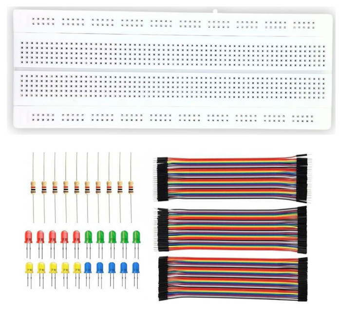

# 附加硬件

在本节中，我们将了解在使用 Raspberry Pi Pico 时可能会用到的一些额外硬件。

## 电子套件

你可以从基础电子套件开始，或在需要时购买元件。只要包含电阻、杜邦线和面包板，一个简单且低成本的套件就足以入门。这些物品在整个课程中都会用到。

    
    
基础电子套件

本书使用的其他元件包括 LED、HC SR04 超声波传感器、有源和无源蜂鸣器、SG90 微型舵机、LDR、NTC 热敏电阻、RC522 RFID 读卡器、micro SD 卡适配器、HD44780 显示屏以及摇杆模块。

## 可选硬件：Debug Probe

Raspberry Pi Debug Probe 让为 Pico 2 刷写固件变得容易得多。如果没有它，每次想上传新固件时都必须按下 BOOTSEL 按钮。该调试器还提供完善的调试支持，非常有用。

该工具是可选的。你可以在没有它的情况下完成整本书（与 debug probe 相关的部分除外）。我最初使用 Pico 时没有调试器，后来才购买了它。

    
    
Raspberry Pi Pico Debug Probe

### 如何决定？

如果预算紧张，可以暂时跳过它，因为其价格大约是 Pico 2 的两倍。如果成本不是问题，它是一次不错的购买，而且非常方便。如果你有第二块 Pico，也可以将其用作低成本的 debug probe。
