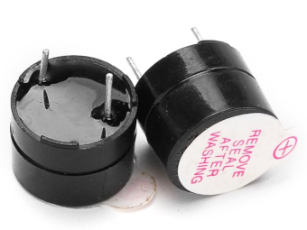

## Introduction to Buzzer

A buzzer is an electronic device used to generate sound, beeps, or even melodies, and is commonly found in alarm systems, timers, computers, and for confirming user inputs, such as mouse clicks or keystrokes. Buzzers serve as audio signaling devices, providing audible feedback for various actions.

## Active Buzzer vs Passive Buzzer
### Active Buzzer:
- **Built-in Oscillator**: An active buzzer has an internal oscillator that generates the tone automatically when power is applied. You can identify whether you have active buzzer or not by connecting the buzzer directly to the battery and it will make a sound.
- **Simpler Usage**: No need to worry about generating specific frequencies since the buzzer does it internally.
- **Tone**: Typically produces a single tone or a fixed frequency.

- **How to identify**: Usually has a white covering on top and a black smooth finish at the bottom. It produces sound when connected directly to a battery.

### Passive Buzzer:
- **External Signal Required**: A passive buzzer requires an external signal (usually a square wave) to generate sound. It does not have an internal oscillator, so it relies on a microcontroller to provide a frequency.
- **Flexible Tones**: You can control the frequency and create different tones, melodies, or alarms based on the input signal.

- **How to identify**: Typically has no covering on the top and looks like a PCB-style blue or green covering at the bottom.

## Which one ?

### Choose **Active Buzzer** if:
- You need a simple, fixed tone or beep. It's ideal for basic alerts, alarms, or user input confirmation.

### Choose **Passive Buzzer** if:
- You want to generate different tones, melodies, or sound patterns.

It is recommended to use a passive buzzer for our exercises. However, if you only have an active buzzer, don't worry; you can still use it. In fact, I personally used an active buzzer for this.
