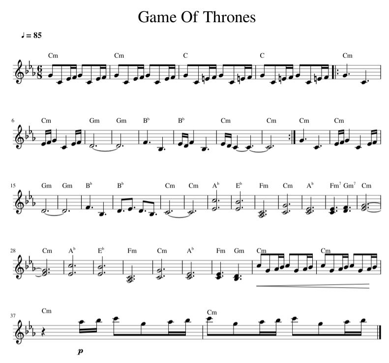

## Introduction to Music Notes and Sheet Music

This is a brief guide to music notes and sheet music. While it may not cover everything, it provides a quick reference for key concepts.

### Music Sheet
The notes for the music are based on the following sheet. You can refer to this [Musescore](https://musescore.com/user/8407786/scores/2156716) link for more details.

In music, note durations are represented by the following types, which define how long each note is played:

- **Whole note**: The longest note duration, lasting for 4 beats.
- **Half note**: A note that lasts for 2 beats.
- **Quarter note**: A note that lasts for 1 beat.
- **Eighth note**: A note that lasts for half a beat, or 1/8th of the duration of a whole note.
- **Sixteenth note**: A note that lasts for a quarter of a beat, or 1/16th of the duration of a whole note.

### Dotted Notes
A dotted note is a note that has a dot next to it. The dot increases the note's duration by half of its original value. For example:

- **Dotted half note**: A half note with a dot lasts for 3 beats (2 + 1).
- **Dotted quarter note**: A quarter note with a dot lasts for 1.5 beats (1 + 0.5).

### Tempo and BPM (Beats Per Minute)
Tempo refers to the speed at which a piece of music is played. It is usually measured in **beats per minute** (BPM), indicating how many beats occur in one minute.

