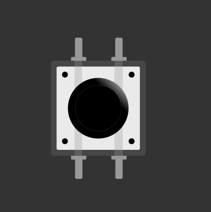

# 按钮

既然我们已经知道如何闪烁 LED，让我们来学习如何读取按钮输入。这将使我们能够与 Raspberry Pi Pico 交互，并让我们的程序对我们的操作做出响应。

    
    
轻触开关按钮

按钮是一个小的轻触开关。你会在大多数初学者电子套件中找到这些。当你按下它时，内部的两个引脚接触，电路闭合。当你松开它时，引脚分离，电路再次断开。你的程序可以读取这种开或关的状态，并据此执行某些操作。

## 轻触按钮如何工作

轻触按钮有四个引脚，成对排列。从上方看按钮，引脚形成一个矩形。按钮每侧的两个引脚在内部是电气连接的。

    
    
按钮内部

我稍后会更新这一部分，提供更清晰的图表，更明确地显示内部连接。目前，这个插图足以理解这个概念。浅色线表示左侧的引脚彼此连接，右侧的引脚也是如此。当按下按钮时，左侧和右侧连接在一起。

## 将按钮连接到 Pico

将按钮的一侧连接到接地（Ground），另一侧连接到通用输入输出（GPIO）引脚（例如 GPIO 15）。当按下按钮时，两侧在内部连接，GPIO 15 引脚被拉低。我们可以在代码中检查引脚是否被拉低，并据此触发动作。

    
    
带有 Raspberry Pi Pico 2 的按钮

等等。当按钮*未*被按下时会发生什么？GPIO 引脚现在读取的是什么电压或电平？为了在逻辑上讲得通，引脚应该处于高电平（High）状态，这样我们才能将低电平（Low）状态检测为按钮按下。但是，如果电路中没有其他东西，GPIO 引脚将处于所谓的*浮动状态（floating state）*。这是不可靠的，即使没有按下按钮，引脚也可能随机地在高电平及低电平之间切换。我们该如何解决这个问题？让我们在下一节中看看。
