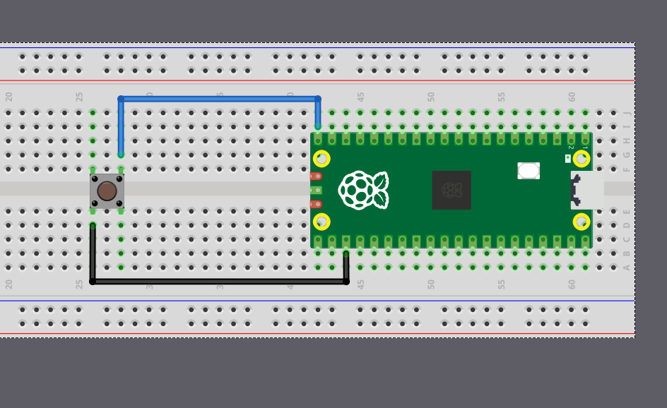

# LED on Button Press

Let's build a simple project that turns on an LED whenever the button is pressed. You can use an external LED or the built in LED. Just change the LED pin number in the code to match the one you are using.


<div class="image-with-caption" style="text-align:center; ">
    
    <div class="caption" style="font-size:0.9em; color:#555; margin-top:6px;">Button with Raspberry Pi Pico 2</div>
</div>

We will start by creating a new project with cargo generate and our template.

In your terminal, type:

```sh
cargo generate --git https://github.com/ImplFerris/pico2-template.git --tag v0.3.1
```

## Button as Input

So far, we've been using the `Output` struct because our Pico was sending signals to the LED. This time, the Pico will receive a signal from the button, so we'll configure it as an `Input`.

```rust
let button = Input::new(p.PIN_15, Pull::Up);
```

We've connected one side of the button to GPIO 15. The other side is connected to Ground. This means when we press the button, the pin gets pulled to the LOW state. As we discussed earlier, without a pull resistor, the input would be left in a floating state and read unreliable values. So we enable the internal pull-up resistor to keep the pin HIGH by default.


## Led as Output

We configure the LED pin as an output, starting in the LOW state (off). If you're using an external LED, uncomment the first line for GPIO 16. If you're using the Pico's built-in LED, use GPIO 25 as shown. Just make sure your circuit matches whichever pin you choose.

```rust
// let mut led = Output::new(p.PIN_16, Level::Low);
let mut led = Output::new(p.PIN_25, Level::Low);
```

## Main loop

Now in a loop, we constantly check if the button is pressed by testing whether it's in the LOW state. We add a small 5-millisecond delay between checks to avoid overwhelming the system. When the button reads LOW (pressed), we set the LED pin HIGH to turn it on, then wait for 3 seconds so we can visually observe it. You can adjust this delay to your preference.

```rust
loop {

    if button.is_low() {
        defmt::info!("Button pressed");
        led.set_high();
        Timer::after_secs(3).await;
    } else {
        led.set_low();
    }

    Timer::after_millis(5).await;
}
```

> <i class="fa-solid fa-bolt"></i> **Debounce:** If you reduce the delay, you might notice that sometimes a single button press triggers multiple detections. This is called "button bounce". When you press a physical button, the metal contacts inside briefly bounce against each other, creating multiple electrical signals in just a few milliseconds. In this example, the 3-second LED delay effectively masks any bounce issues, but in applications where you need to count individual button presses accurately, you'll need debouncing logic.

We also log "Button pressed" using defmt. If you're using a debug probe, use the `cargo embed --release` command to see these logs in your terminal.

## The Full code

```rust
#![no_std]
#![no_main]

use embassy_executor::Spawner;
use embassy_rp::block::ImageDef;
use embassy_rp::gpio::Pull;
use embassy_rp::{
    self as hal,
    gpio::{Input, Level, Output},
};
use embassy_time::Timer;

//Panic Handler
use panic_probe as _;
// Defmt Logging
use defmt_rtt as _;

/// Tell the Boot ROM about our application
#[unsafe(link_section = ".start_block")]
#[used]
pub static IMAGE_DEF: ImageDef = hal::block::ImageDef::secure_exe();

#[embassy_executor::main]
async fn main(_spawner: Spawner) {
    let p = embassy_rp::init(Default::default());

    let button = Input::new(p.PIN_15, Pull::Up);
    // let mut led = Output::new(p.PIN_16, Level::Low);
    let mut led = Output::new(p.PIN_25, Level::Low);

    loop {
        if button.is_low() {
            defmt::info!("Button pressed");
            led.set_high();
            Timer::after_secs(3).await;
        } else {
            led.set_low();
        }
        Timer::after_millis(5).await;
    }
}

// Program metadata for `picotool info`.
// This isn't needed, but it's recomended to have these minimal entries.
#[unsafe(link_section = ".bi_entries")]
#[used]
pub static PICOTOOL_ENTRIES: [embassy_rp::binary_info::EntryAddr; 4] = [
    embassy_rp::binary_info::rp_program_name!(c"button"),
    embassy_rp::binary_info::rp_program_description!(c"your program description"),
    embassy_rp::binary_info::rp_cargo_version!(),
    embassy_rp::binary_info::rp_program_build_attribute!(),
];

// End of file
```

## Clone the existing project

You can clone (or refer) project I created and navigate to the `button` folder.

```sh
git clone https://github.com/ImplFerris/pico2-embassy-projects
cd pico2-embassy-projects/button
```
