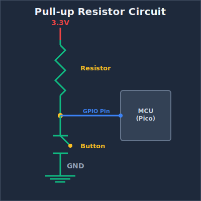

# Pull-up and Pull-down Resistors

When working with buttons, switches, and other digital inputs on your Raspberry Pi Pico, you'll quickly encounter a curious problem: what happens when nothing is connected to an input pin? The answer might surprise you; the pin becomes "floating," picking up electrical noise and giving you random, unpredictable readings. This is where pull-up and pull-down resistors come to the rescue.

## The Floating Pin Problem

Imagine you connect a button directly to a GPIO pin on your Pico. When the button is pressed, it connects the pin to ground (0V). When released, you might expect the pin to read as HIGH, but it doesn't work that way. Instead, the pin is disconnected from everything.  It's floating in an undefined state, acting like an antenna that picks up electrical noise from nearby circuits, your hand, or even radio waves in the air.

<div class="image-with-caption" style="text-align:center; ">
    
    <div class="caption" style="font-size:0.9em; color:#555; margin-top:6px;">Floating Input - One side connected to Ground</div>
</div>

This floating state will cause your code to read random values, making your button appear to press itself or behave erratically. We need a way to give the pin a default, predictable state.

By the way, you can also connect the button the other way around; connecting one side to 3.3V instead of ground (though I wouldn't recommend this for the RP2350, and I'll explain why shortly). However, you'll face the same issue. When the button is pressed, it connects to the High state. When released, you might expect it to go Low, but instead it's in a floating state again.

<div class="image-with-caption" style="text-align:center; ">
    
    <div class="caption" style="font-size:0.9em; color:#555; margin-top:6px;">Floating Input - One side connected to 3.3V</div>
</div>

## What Are Pull-up and Pull-down Resistors?

Pull-up and pull-down resistors are simple solutions that ensure a pin always has a known voltage level, even when nothing else is driving it.

Pull-up resistor: Connects the pin to the positive voltage (3.3V on the Pico) through a resistor. This "pulls" the pin HIGH by default. When you press a button that connects the pin to ground, the pin reads LOW.

Pull-down resistor: Connects the pin to ground (0V) through a resistor. This "pulls" the pin LOW by default. When you press a button that connects the pin to 3.3V, the pin reads HIGH.

### How Pull-up Resistors Work

Let's look at a typical button circuit with a pull-up resistor:

<div class="image-with-caption" style="text-align:center; ">
    
    <div class="caption" style="font-size:0.9em; color:#555; margin-top:6px;">Pull-Up Resistor</div>
</div>

When the button is not pressed, current flows through the resistor to the GPIO pin, holding it at 3.3V (HIGH). When you press the button, you create a direct path to ground. Since electricity follows the path of least resistance, current flows through the button to ground instead of to the pin, and the pin reads LOW.

## How Pull-down Resistors Work

A pull-down resistor works in the opposite direction:W

<div class="image-with-caption" style="text-align:center; ">
    
    <div class="caption" style="font-size:0.9em; color:#555; margin-top:6px;">Pull-Down Resistor</div>
</div>

When the button is not pressed, the GPIO pin is connected to ground through the resistor, reading LOW. When pressed, the button connects the pin directly to 3.3V, and the pin reads HIGH.


## Internal Pull Resistors

The Raspberry Pi Pico has built-in pull-up and pull-down resistors on every GPIO pin. You don't need to add external resistors for basic button inputs. You can enable them in software.

### Using Pull Resistors in Embedded Rust

Let's see how to configure internal pull resistors when setting up a button input on the Pico.

<div class="image-with-caption" style="text-align:center; ">
    
    <div class="caption" style="font-size:0.9em; color:#555; margin-top:6px;">Internal Pull-Up Resistor</div>
</div>

As you can see in the diagram, when we enable the internal pull-up resistor, the GPIO pin is pulled to 3.3V by default. The resistor sits inside the Pico chip itself, so we don't need any external components; just the button connected between the GPIO pin and ground.

Here's how to set it up in code:

```rust
let button = Input::new(p.PIN_16, Pull::Up);

// Read the button state
if button.is_low() {
    // Button is pressed (connected to ground)
    // Do something
}
```

With a pull-up resistor enabled, the GPIO pin gets pulled to HIGH voltage by default. When you press the button, it connects the pin to ground, and brings the pin LOW. So the logic is: button not pressed = HIGH, button pressed = LOW.

**Setting up a Button with a Pull-down Resistor**

Here's similar code, but this time we use the internal pull-down resistor. With pull-down, the pin is pulled LOW by default. When the button is pressed, connecting the pin to 3.3V, it reads HIGH.

```rust
let button = Input::new(p.PIN_16, Pull::Down);

// Read the button state
if button.is_high() {
    // Button is pressed (connected to 3.3V)
    // Do something
}
```

> <i class="fa-solid fa-bolt"></i> **Note:** There's a hardware bug (E9) in the initial RP2350 chip released in 2024 that affects internal pull-down resistors.
>
> The bug causes the GPIO pin to read HIGH even when the button isn't pressed, which is the opposite of what should happen. You can read more about this issue in [this blog post](https://www.doctormonk.com/2024/09/are-pico-2-rp2350-gpio-pins-broken.html).
>
> The bug was fixed in the newer RP2350 A4 chip revision. If you're using an older chip, avoid using `Pull::Down` in your code. Instead, you can use an external pull-down resistor and set `Pull::None` in the code.

With a pull-down resistor enabled, the button should connect to 3.3V when pressed. The pin reads LOW when not pressed, and HIGH when pressed.

## Using a Floating Input

You can also configure a pin without any internal pull resistor:

```rust
let button = Input::new(p.PIN_16, Pull::None);
```

However, as we discussed earlier, floating inputs are unreliable for buttons because they pick up electrical noise and read random values. This option is only useful when you have an external pull-up or pull-down resistor in your circuit, or when connecting to devices that actively drive the pin HIGH or LOW (like some sensors).
