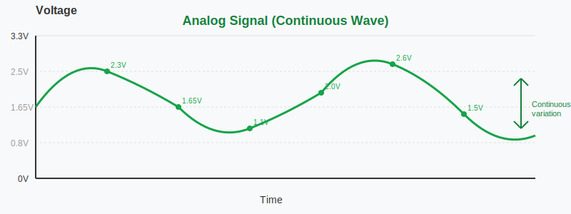

# Pulse Width Modulation (PWM)

In this section, we will explore what is PWM and why we need it.

## Digital vs Analog

To understand PWM, we first need to understand what is digital and analog signal.

### Digital Signals

A digital signal has only two states: HIGH or LOW. In microcontrollers, HIGH typically means the full voltage (5V or 3.3V), and LOW means 0V. There's nothing in between. Think of it like a light switch that can only be fully ON or fully OFF.

When you use a digital pin on your microcontroller, you can only output these two values. If you write HIGH to a pin, it outputs 3.3V. If you write LOW, it outputs 0V. You cannot tell a digital pin to output 1.5V or 2.7V or any value in between.

## Analog Signals

An analog signal can have any voltage value within a range. Instead of just ON or OFF, it varies continuously and smoothly. Think of it like a dimmer switch that can set brightness anywhere from completely off to fully bright, with infinite positions in between.

For example, an analog signal could be 0V, 0.5V, 1.5V, 2.8V, 3.1V, or any other value within the allowed range. This smooth variation allows you to have precise control over devices.

## The Problem

Here's the challenge: most microcontroller pins are digital. They can only output HIGH or LOW. But what if you want to:

Dim an LED to 50% brightness instead of just fully ON or fully OFF (like we did in the quick-start blinking example)? Or Control a servo motor to any position between 0° and 180°? Or Adjust the speed of a fan or control temperature gradually?

You need something that acts like an analog output, but you only have digital pins. This is where PWM comes in.
