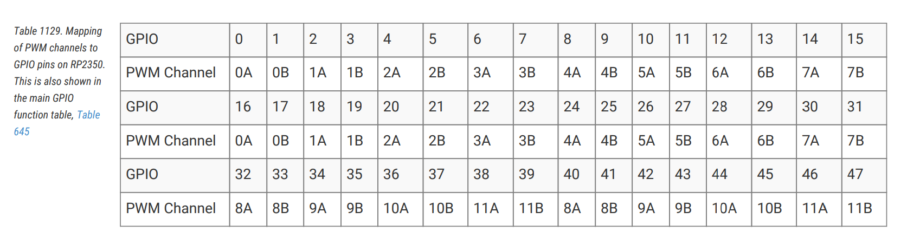

# RP2350 中的 PWM 外设

RP2350 有一个包含 12 个 PWM 生成器（称为“Slice”）的脉宽调制（PWM）外设。每个 Slice 包含两个输出通道（A 和 B），总共提供 24 个 PWM 输出通道。详细规格请参阅 [RP2350 Datasheet](https://datasheets.raspberrypi.com/rp2350/rp2350-datasheet.pdf) 第 1076 页。


让我们快速了解一些核心概念。

## PWM 生成器（Slice）

Slice 是生成 PWM 信号的硬件块。12 个 Slice（PWM0–PWM11）中的每一个都是独立的计时单元，拥有自己的 16 位计数器、比较寄存器、控制设置和时钟分频器。这种独立性意味着你可以为每个 Slice 配置不同的频率和分辨率。


## 通道

每个 Slice 包含两个输出通道：**通道 A** 和 **通道 B**。两个通道共享同一个计数器，因此它们运行在相同的频率且完全同步。但是，每个通道都有自己的比较寄存器，允许独立控制占空比。这让你能够从单个 Slice 生成两个相关但不同的 PWM 信号。


## PWM 通道到 GPIO 引脚的映射

每个通用输入输出（GPIO）引脚连接到特定的 Slice 和通道。你可以在 [RP2350 Datasheet](https://datasheets.raspberrypi.com/rp2350/rp2350-datasheet.pdf) 第 1078 页找到完整的映射表。例如，GP25（板载 LED 灯引脚）映射到 PWM Slice 4 的通道 B，标记为 **4B**。



初始化 PWM 外设并获取所有 Slice 的访问权限：

```rust
let mut pwm_slices = hal::pwm::Slices::new(pac.PWM, &mut pac.RESETS);
```

获取 PWM Slice 4 的引用以进行配置：

```rust
let pwm = &mut pwm_slices.pwm4;
```

### GPIO 到 PWM

我创建了一个小表单，帮助你弄清楚哪个 GPIO 引脚映射到哪个 PWM 通道，并生成示例代码。

<div class="pwm-mapper">
    <label for="gpio-select"><strong>选择 GPIO 引脚：</strong></label>
    <select id="gpio-select">
        <option value="">-- 选择 GPIO --</option>
    </select>
    <div id="result-container" style="display: none;">
        <div class="pwm-info">
            <strong>GPIO：</strong> <span id="gpio-value"></span> | 
            <strong>PWM Slice：</strong> <span id="slice-value"></span> | 
            <strong>通道：</strong> <span id="channel-value"></span>
        </div>
        <div class="code-header">Embassy</div>
        <pre><code class="rust" id="embassy-code"></code></pre>
        <div class="code-header">rp-hal</div>
        <pre><code class="rust" id="rp-hal-code"></code></pre>
    </div>
    <div id="placeholder" class="placeholder">
        选择一个 GPIO 引脚以查看 PWM 映射和生成的代码。
    </div>
</div>

## 相位修正模式

在标准 PWM（快速 PWM）中，计数器从 0 计数到 TOP，然后立即重置为 0。这会产生不对称的边缘，输出在周期的不同点发生变化。

相位修正 PWM 计数到 TOP，然后倒数回 0，产生三角波形。输出对称切换——一次上升，一次下降。这产生中心对齐的脉冲，边缘相互镜像，减少了电磁干扰并产生更平滑的过渡。代价是相位修正模式在相同的 TOP 值下运行频率是标准 PWM 的一半。

配置 PWM4 以在相位修正模式下运行，以获得更平滑的输出过渡。

```rust
pwm.set_ph_correct();
```

获取 PWM4 通道 B 的可变引用，并将其输出指向 GPIO 引脚 25。
```rust
let channel = &mut pwm.channel_b;
channel.output_to(pins.gpio25);
```

<style>
.pwm-mapper {
    margin: 20px 0;
    background: linear-gradient(135deg, #667eea15 0%, #764ba215 100%);
    border: 1px solid #e0e0e0;
    border-radius: 8px;
    padding: 20px;
}

.pwm-mapper label {
    display: block;
    font-weight: 600;
    margin-bottom: 8px;
}

.pwm-mapper select {
    padding: 10px 14px;
    border: 2px solid #ddd;
    border-radius: 6px;
    font-size: 14px;
    margin-bottom: 20px;
    min-width: 200px;
    transition: border-color 0.2s;
}

.pwm-mapper select:focus {
    outline: none;
    border-color: #667eea;
}

.pwm-info {
    background: linear-gradient(to right, #667eea, #764ba2);
    color: white;
    padding: 14px 16px;
    border-radius: 6px;
    margin-bottom: 20px;
    font-size: 14px;
    box-shadow: 0 2px 8px rgba(102, 126, 234, 0.3);
}

.pwm-info strong {
    color: white;
    font-weight: 600;
}

.code-header {
    font-weight: 600;
    margin-bottom: 8px;
    margin-top: 15px;
    /* color: #667eea; */
    font-size: 14px;
}

.code-header:first-of-type {
    margin-top: 0;
}

.placeholder {
    font-style: italic;
    padding: 30px 0;
    text-align: center;
    border-radius: 6px;
    border: 2px dashed #ddd;
}
</style>


<script>
const pwmMapping = {
    0: { slice: 0, channel: 'A' }, 1: { slice: 0, channel: 'B' },
    2: { slice: 1, channel: 'A' }, 3: { slice: 1, channel: 'B' },
    4: { slice: 2, channel: 'A' }, 5: { slice: 2, channel: 'B' },
    6: { slice: 3, channel: 'A' }, 7: { slice: 3, channel: 'B' },
    8: { slice: 4, channel: 'A' }, 9: { slice: 4, channel: 'B' },
    10: { slice: 5, channel: 'A' }, 11: { slice: 5, channel: 'B' },
    12: { slice: 6, channel: 'A' }, 13: { slice: 6, channel: 'B' },
    14: { slice: 7, channel: 'A' }, 15: { slice: 7, channel: 'B' },
    16: { slice: 0, channel: 'A' }, 17: { slice: 0, channel: 'B' },
    18: { slice: 1, channel: 'A' }, 19: { slice: 1, channel: 'B' },
    20: { slice: 2, channel: 'A' }, 21: { slice: 2, channel: 'B' },
    22: { slice: 3, channel: 'A' }, 23: { slice: 3, channel: 'B' },
    24: { slice: 4, channel: 'A' }, 25: { slice: 4, channel: 'B' },
    26: { slice: 5, channel: 'A' }, 27: { slice: 5, channel: 'B' },
    28: { slice: 6, channel: 'A' }, 29: { slice: 6, channel: 'B' },
    30: { slice: 7, channel: 'A' }, 31: { slice: 7, channel: 'B' },
    32: { slice: 8, channel: 'A' }, 33: { slice: 8, channel: 'B' },
    34: { slice: 9, channel: 'A' }, 35: { slice: 9, channel: 'B' },
    36: { slice: 10, channel: 'A' }, 37: { slice: 10, channel: 'B' },
    38: { slice: 11, channel: 'A' }, 39: { slice: 11, channel: 'B' },
    40: { slice: 8, channel: 'A' }, 41: { slice: 8, channel: 'B' },
    42: { slice: 9, channel: 'A' }, 43: { slice: 9, channel: 'B' },
    44: { slice: 10, channel: 'A' }, 45: { slice: 10, channel: 'B' },
    46: { slice: 11, channel: 'A' }, 47: { slice: 11, channel: 'B' }
};

const gpioSelect = document.getElementById('gpio-select');
for (let i = 0; i <= 47; i++) {
    const option = document.createElement('option');
    option.value = i;
    option.textContent = `GPIO ${i}`;
    if (i === 25) {
        option.selected = true;
    }
    gpioSelect.appendChild(option);
}

function generateEmbassyCode(gpio, slice, channel) {
    const ch = channel.toLowerCase();
    return `let mut pwm_pin = Pwm::new_output_${ch}(p.PWM_SLICE${slice}, p.PIN_${gpio}, Default::default());`;
}

function generateRpHalCode(gpio, slice, channel) {
    const ch = channel.toLowerCase();
    return `let pwm = &mut pwm_slices.pwm${slice};
pwm.set_ph_correct();
pwm.enable();
let pwm_pin = &mut pwm.channel_${ch};
pwm_pin.output_to(pins.gpio${gpio});`;
}

gpioSelect.addEventListener('change', function() {
    const gpio = this.value;
    if (!gpio) {
        document.getElementById('result-container').style.display = 'none';
        document.getElementById('placeholder').style.display = 'block';
        return;
    }

    const { slice, channel } = pwmMapping[gpio];

    document.getElementById('gpio-value').textContent = gpio;
    document.getElementById('slice-value').textContent = slice;
    document.getElementById('channel-value').textContent = channel;

    document.getElementById('embassy-code').textContent = generateEmbassyCode(gpio, slice, channel);
    document.getElementById('rp-hal-code').textContent = generateRpHalCode(gpio, slice, channel);

    document.getElementById('result-container').style.display = 'block';
    document.getElementById('placeholder').style.display = 'none';
});

// Trigger change event on page load to show GPIO 25 by default
gpioSelect.dispatchEvent(new Event('change'));
</script>
