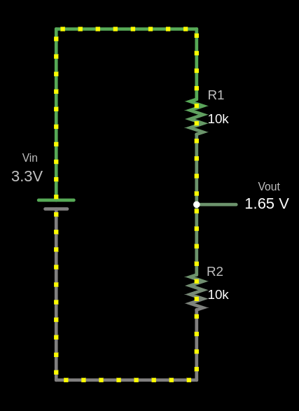

# Voltage Divider

A voltage divider is a simple circuit that reduces a higher input voltage to a lower output voltage using two resistors connected in series. You might need a voltage divider from time to time when working with sensors or modules that output higher voltages than your microcontroller can safely handle.

The resistor connected to the input voltage is called \\( R_{1} \\), and the resistor connected to ground is called \\( R_{2} \\). The output voltage \\( V_{out} \\) is measured at the point between \\( R_{1} \\) and \\( R_{2} \\), and it will be a fraction of the input voltage \\( V_{in} \\).


## Circuit



The output voltage (V<sub>out</sub>) is calculated using this formula:

\\[
V_{out} = V_{in} \times \frac{R_2}{R_1 + R_2}
\\]

### Example Calculation for \\( V_{out} \\)

Given:
- \\( V_{in} = 3.3V \\)
- \\( R_1 = 10 k\Omega \\)
- \\( R_2 = 10 k\Omega \\)

Substitute the values:

\\[
V_{out} = 3.3V \times \frac{10 k\Omega}{10 k\Omega + 10 k\Omega} = 3.3V \times \frac{10}{20} = 3.3V \times 0.5 = 1.65V
\\]


The output voltage \\( V_{out} \\) is 1.65V.


```rust,editable
fn main() {
    // You can edit the code
    // You can modify values and run the code 
    let vin: f64 = 3.3;
    let r1: f64 = 10000.0;
    let r2: f64 = 10000.0;

    let vout = vin * (r2 / (r1 + r2));

    println!("The output voltage Vout is: {:.2} V", vout);
}
```

## Use cases

Voltage dividers are used in applications like potentiometers, where the resistance changes as the knob is rotated, adjusting the output voltage. They are also used to measure resistive sensors such as light sensors and thermistors, where a known voltage is applied, and the microcontroller reads the voltage at the center node to determine sensor values like temperature.

## Voltage Divider Simulation
<style>
canvas {
    border: 1px solid #ccc;
    margin-top: 20px;
    background:white;
}
</style>
<label for="vin">Input Voltage (V<sub>in</sub>):</label>
<input type="number" id="vin" step="0.01" value="3.3" oninput="updateAndCalculate()"><br><br>

<label for="r1">Resistor R1 (Ω):</label>
<input type="number" id="r1" step="1" value="10000" oninput="updateAndCalculate()"><br><br>

<label for="r2">Resistor R2 (Ω):</label>
<input type="number" id="r2" step="1" value="10000" oninput="updateAndCalculate()"><br><br>

<p class="formula" id="formula">
    Formula: V<sub>out</sub> = V<sub>in</sub> × (R<sub>2</sub> / (R<sub>1</sub> + R<sub>2</sub>))
</p>
<p class="formula" id="filledFormula">
    Filled Formula: V<sub>out</sub> = 3.3 × (10000 / (10000 + 10000))
</p>
<p id="result">Output Voltage (Vout): 1.65 V</p>

<canvas id="circuitCanvas" width="600" height="400"></canvas>


## Simulator in Falstad website

I used the website [https://www.falstad.com/circuit/](https://www.falstad.com/circuit/) to create the diagram. It's a great tool for drawing circuits. You can download the file I created, [`voltage-divider.circuitjs.txt`](./voltage-divider.circuitjs.txt), and import it to experiment with the circuit.


<script>
    function updateAndCalculate() {
        updateFormula();
        calculateVoltage();
        drawCircuit();
    }

    function updateFormula() {
        const vin = parseFloat(document.getElementById('vin').value) || 0;
        const r1 = parseFloat(document.getElementById('r1').value) || 0;
        const r2 = parseFloat(document.getElementById('r2').value) || 0;

        document.getElementById('filledFormula').textContent = 
            `Filled Formula: Vout = ${vin} × (${r2} / (${r1} + ${r2}))`;
    }

    function calculateVoltage() {
        const vin = parseFloat(document.getElementById('vin').value);
        const r1 = parseFloat(document.getElementById('r1').value);
        const r2 = parseFloat(document.getElementById('r2').value);

        if (isNaN(vin) || isNaN(r1) || isNaN(r2) || r1 <= 0 || r2 <= 0) {
            document.getElementById('result').textContent = 
                "Please enter valid positive numbers for all fields.";
            return;
        }

        const vout = vin * (r2 / (r1 + r2));
        document.getElementById('result').textContent = 
            `Output Voltage (Vout): ${vout.toFixed(2)} V`;
    }

    function drawZigZagResistor(ctx, x, y, width, height) {
        const segments = 6;
        const step = height / segments;
        const segmentWidth = width / 2;

        ctx.beginPath();
        ctx.moveTo(x, y);

        for (let i = 0; i < segments; i++) {
            const offset = (i % 2 === 0) ? segmentWidth : -segmentWidth;
            ctx.lineTo(x + offset, y + step * (i + 1));
        }

        const finalOffset = (segments % 2 === 0) ? segmentWidth : -segmentWidth;
        ctx.lineTo(x + 1, y + height + 4);
        ctx.lineWidth = 2;
        ctx.stroke();
    }

    function drawGroundSymbol(ctx, x, y) {
        const lineSpacing = 5;
        const topLineWidth = 20;

        ctx.beginPath();
        ctx.moveTo(x - topLineWidth / 2, y);
        ctx.lineTo(x + topLineWidth / 2, y);
        ctx.stroke();

        const middleLineWidth = topLineWidth * 0.6;
        ctx.beginPath();
        ctx.moveTo(x - middleLineWidth / 2, y + lineSpacing);
        ctx.lineTo(x + middleLineWidth / 2, y + lineSpacing);
        ctx.stroke();

        const bottomLineWidth = middleLineWidth * 0.6;
        ctx.beginPath();
        ctx.moveTo(x - bottomLineWidth / 2, y + 2 * lineSpacing);
        ctx.lineTo(x + bottomLineWidth / 2, y + 2 * lineSpacing);
        ctx.stroke();
    }

    function drawCircuit() {
        const canvas = document.getElementById('circuitCanvas');
        const ctx = canvas.getContext('2d');
        const vin = parseFloat(document.getElementById('vin').value) || 0;
        const r1 = parseFloat(document.getElementById('r1').value) || 0;
        const r2 = parseFloat(document.getElementById('r2').value) || 0;
        const vout = vin * (r2 / (r1 + r2)) || 0;

        ctx.clearRect(0, 0, canvas.width, canvas.height);

        ctx.fillStyle = 'black';
        ctx.font = '16px Arial';
        ctx.fillText(`V_in: ${vin.toFixed(2)} V`, 35, 94);
        ctx.beginPath();
        ctx.moveTo(100, 100);
        ctx.lineTo(150, 100);
        ctx.stroke();

        ctx.moveTo(130, 100);
        ctx.lineTo(170, 100);
        ctx.stroke();

        ctx.beginPath();
        ctx.moveTo(170, 100);
        ctx.lineTo(170, 130);
        ctx.stroke();

        ctx.fillText(`R1: ${r1} Ω`, 200, 155);
        drawZigZagResistor(ctx, 170, 130, 23, 40);

        ctx.beginPath();
        ctx.moveTo(170, 175);
        ctx.lineTo(170, 230);
        ctx.stroke();

        ctx.fillText(`R2: ${r2} Ω`, 200, 256);
        drawZigZagResistor(ctx, 170, 230, 20, 40);

        ctx.beginPath();
        ctx.moveTo(170, 275);
        ctx.lineTo(170, 300);
        ctx.stroke();
        ctx.fillText('Ground', 160, 330);

        drawGroundSymbol(ctx, 170, 300);

        ctx.beginPath();
        ctx.moveTo(170, 200);
        ctx.lineTo(270, 200);
        ctx.stroke();
        ctx.fillText(`V_out: ${vout.toFixed(2)} V`, 280, 203);
    }

    updateAndCalculate();
</script>
