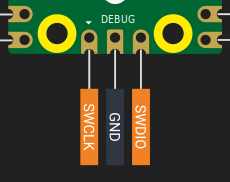

# 用于 Raspberry Pi Pico 2 的调试器（Debug Probe）

每次烧录新程序时都要按 BOOTSEL 按钮非常麻烦。像 ESP32 DevKit 这样的开发板大多能自动完成这一步，因为开发板可以在需要时将芯片重置到引导加载程序（bootloader）模式。Pico 2 本身不具备此功能，但通过使用调试器（debug probe），你不仅能获得同样的便利性，还能拥有更强的调试能力。

本章将解释为什么调试器很有用，并逐步指导你如何设置并使用它，在无需按 BOOTSEL 按钮的情况下对 Pico 2 进行烧录和调试。

## Raspberry Pi 调试器（Raspberry Pi Debug Probe）

Raspberry Pi 调试器是官方推荐用于 Pico 和 Pico 2 上 SWD 调试的工具。它是一个小型 USB 设备，充当 CMSIS-DAP 适配器。CMSIS-DAP 是一种开源调试器标准，允许你的电脑通过 SWD 协议与微控制器通信。

<div class="image-with-caption" style="text-align:center; ">
    
    <div class="caption" style="font-size:0.9em; color:#555; margin-top:6px;">图片来源：<a href="https://www.raspberrypi.com/documentation/microcontrollers/debug-probe.html">raspberrypi.com</a> — 调试器连接 Pico。</div>
</div>

该调试器提供两大核心功能：

1. **SWD（Serial Wire Debug，串行线调试）接口**：连接到 Pico 的调试引脚，用于烧录固件和进行实时调试。你可以设置断点、检查变量，就像在普通桌面应用程序中调试一样。
2. **UART 桥接器**：提供 USB 转串口连接，让你能在电脑上查看控制台输出或与开发板通信。

这两项功能都通过同一根连接到电脑的 USB 线实现，因此无需额外的 UART 设备，使整体设置更加简洁。

## 焊接 SWD 引脚

在将调试器连接到 Pico 2 之前，你需要让 [SWD 引脚](../pico2-pinout.md#swd-debugging-pins) 可被访问。这些引脚位于 Pico 板底部边缘，是一个独立于主 GPIO 引脚的小型 3 针调试排针。

<div class="image-with-caption" style="text-align:center; display:inline-block;">
    
    <div class="caption" style="font-size:0.9em; color:#555; margin-top:6px;">SWD 调试引脚</div>
</div>

一旦焊接好 SWD 引脚，你的 Pico 就可以连接调试器了。

## 准备调试器

你的调试器出厂时可能未预装最新固件，尤其是尚未包含对 Pico 2（RP2350 芯片）支持的版本。建议在开始使用前先更新固件。

Raspberry Pi 官方文档提供了清晰的调试器固件更新说明。请按照[此处](https://www.raspberrypi.com/documentation/microcontrollers/debug-probe.html#updating-the-firmware-on-the-debug-probe)提供的步骤操作。

## 将 Pico 与调试器连接

调试器侧面有两个端口：

- **D 端口**：用于 SWD（调试）连接  
- **U 端口**：用于 UART（串口）连接  

### SWD 连接（必需）

SWD 连接用于烧录固件和使用调试器。请使用随调试器附带的 JST 转杜邦线。

将调试器 D 端口的线缆按如下方式连接到 Pico 2 引脚：

| 调试器线缆颜色 | Pico 2 引脚 |
| ------------ | ----------- |
| 橙色         | SWCLK       |
| 黑色         | GND         |
| 黄色         | SWDIO       |

连接前请确保 Pico 2 的 SWD 引脚已正确焊接。

### UART 连接（可选）

如果你希望在电脑终端中查看串口输出（例如来自 Rust 的 `println!` 日志），UART 连接会非常有用。它与 SWD 连接相互独立。

将调试器 U 端口的线缆连接到 Pico 2 引脚：

| 调试器线缆颜色 | Pico 2 引脚          | 物理引脚编号 |
| ------------ | -------------------- | ------------ |
| 黄色         | GP0（Pico 的 TX）    | **引脚 1**   |
| 橙色         | GP1（Pico 的 RX）    | **引脚 2**   |
| 黑色         | GND                  | **引脚 3**   |

虽然你可以使用任意配置为 UART 的 GPIO 引脚，但 GP0 和 GP1 是 Pico 默认的 UART0 引脚。

### 为 Pico 供电

调试器**不会**为 Pico 2 供电，仅提供 SWD 和 UART 信号。要为 Pico 2 供电，请将调试器通过 USB 连接到电脑，同时通过 Pico 2 自身的 USB 接口为其单独供电。只有两个设备都通电，调试才能正常工作。

### 最终设置

连接完成后：
1. 将调试器通过 USB 插入电脑  
2. 确保 Pico 2 已通电  
3. 调试器上的红色 LED 应点亮，表示已通电  
4. 设置完成——从此无需再按 BOOTSEL 按钮  

你现在可以直接通过开发环境对 Pico 2 进行烧录和调试，无需任何手动干预。

## 测试连接

要验证调试器与 Pico 2 是否正确连接，可以使用快速入门项目进行测试：

```sh
git clone https://github.com/ImplFerris/pico2-quick
cd pico2-quick
```

你不能像之前那样直接使用 `cargo run`，除非你修改了 `config.toml` 文件。因为该项目默认使用 `picotool` 作为运行器。你可以注释掉 `picotool` 运行器并启用 `probe-rs` 运行器，之后就能使用 `cargo run` 命令。

或者更简单的方式（推荐）：直接使用 `probe-rs` 提供的以下命令，通过调试器烧录程序：

```sh
cargo flash
# 或
cargo flash --release
```

## cargo embed

你可以使用 `cargo embed` 命令烧录程序并在终端中实时查看日志输出。快速入门项目已配置为通过 RTT 发送日志消息，因此无需额外配置即可直接使用。

```sh
cargo embed
# 或 
cargo embed --release
```

如果你还不熟悉 RTT，我们稍后会详细解释。现在你只需运行上述命令，即可看到程序运行并打印日志。

如果一切正常，你应该会在系统终端中看到 “Hello, World!” 消息。

<div class="image-with-caption" style="text-align:center; ">
    
    <div class="caption" style="font-size:0.9em; color:#555; margin-top:6px;">cargo embed 显示 defmt 日志</div>
</div>

## 参考资料

- [Raspberry Pi 调试器 — 官方文档](https://www.raspberrypi.com/documentation/microcontrollers/debug-probe.html)