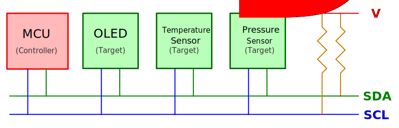
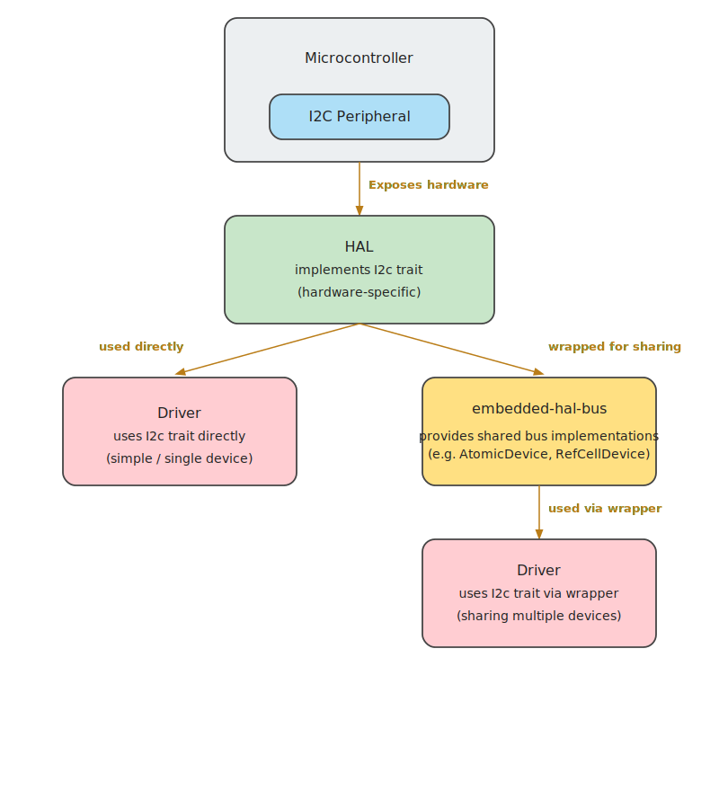

# Using I2C with the Embedded Rust Ecosystem

In the previous section, we learned the basics of I2C communication and how the controller-target (master-slave) model works. Now, let's see how these concepts apply in the Embedded Rust ecosystem, where modular and reusable design is a key principle.

## The Role of embedded-hal

The embedded-hal crate defines a standard set of traits for embedded hardware abstraction, including I2C. These traits allow driver code (like for displays or sensors) to be written generically so that it can run on many different microcontrollers without needing platform-specific changes.

The core I2C trait looks like this:

```rust
pub trait I2c<A: AddressMode = SevenBitAddress>: ErrorType {
    // This method must be implemented by HAL authors
    fn transaction(...);
    // These are default methods built on top of `transaction`
    fn read(...);
    fn write(...);
    fn write_read(...);
}
```

The only method that the HAL is required to implement is transaction. The trait provides default implementations of read, write, and write_read using this method.

The generic type parameter A specifies the address mode and has a default type parameter of `SevenBitAddress`. So, in most cases you don't need to specify it manually. For 10-bit addressing, you can use TenBitAddress instead.

Microcontroller-specific HAL crates (like esp-hal, stm32-hal, or nrf-hal) implement this trait for their I2C peripherals. For example, the esp-hal crate implements I2C. If you are curious, you can look at the implementation [here](https://github.com/esp-rs/esp-hal/blob/de67c3101346cdbe030ffa1bb95b13943ee8d790/esp-hal/src/i2c/master/mod.rs#L671).

> In addition to the regular embedded-hal crate, there is an async version called embedded-hal-async. It defines similar traits, but they are designed to work with async code, which is useful when writing non-blocking drivers or tasks in embedded systems.


## Platform-Independent Drivers

Imagine you are writing a driver for a sensor or a display that communicates over I2C. You don't want to tie your code to a specific microcontroller like the Raspberry Pi Pico or ESP32. Instead, you can write the driver in a generic way using the embedded-hal trait.

As long as your driver only depends on the I2C trait, it can run on any platform that provides an implementation of this trait-such as STM32, nRF, or ESP32.

## Sharing the I2C Bus

Many embedded projects connect multiple I2C devices (like an OLED display, an LCD, and various sensors) to the same SDA and SCL lines. However, only one device can control the bus at a time.


<p align="center"><em>Figure: Microcontroller(Pico) and Multiple Devices</em></p>

If you give exclusive access to one driver, other devices cannot communicate. This is where the embedded-hal-bus crate helps.

It provides wrapper types like AtomicDevice, CriticalSectionDevice, and RefCellDevice that allow multiple drivers to safely share access to the same I2C bus. These wrappers themselves implement the I2c trait, so drivers can use them as if they were the original bus.

You can use I2C in two ways:




- Without sharing: If your application only talks to one I2C device, you can pass the I2C bus instance provided by the HAL (which implements the I2c trait) directly to the driver.

- With sharing: If your application needs to communicate with multiple I2C devices on the same bus, you can wrap the I2C bus instance (provided by the HAL) using one of the sharing types from the embedded-hal-bus crate, such as AtomicDevice or CriticalSectionDevice. This allows safe, coordinated access across multiple drivers.
 
## Resources

- [embedded-hal docs on I2C](https://docs.rs/embedded-hal/latest/embedded_hal/i2c/index.html): This documentation provides in-depth details on how I2C traits are structured and how they are intended to be used across different platforms.

