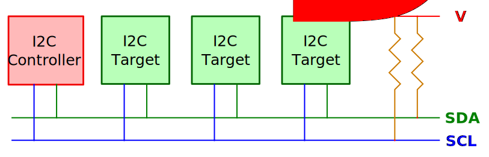

# Inter-Integrated Circuit (I2C)

So far, we've been toggling output pins between High and Low states to control an LED and reading the same two levels from a button. But working with interesting devices like display modules, RFID readers, and SD card readers requires something more. Simple pin toggling won't work here. We need a proper communication mechanism, and that's where communication protocols come in. The most common ones are I2C, SPI, and UART. Each one has its own advantages and disadvantages.

Since we will be using an OLED display in the next chapter, and it communicates over I2C, this is the first protocol we are going to explore. OLED displays are one of the modules I enjoy the most. I've used them to make small games and a bunch of fun personal projects.

##  What Is I2C?

I2C stands for Inter-Integrated Circuit, also written as I²C. It's one of the popular communication methods used by microcontrollers to talk to sensors, displays (like OLEDs), and other chips. It is a serial, half-duplex, and synchronous interface. Let's break down what that means.

- Serial means data is transferred one bit at a time over a single data line. Think of it like a one-lane bridge where cars (bits of data) pass through one after another in a straight line.

- Half-duplex means data travels in only one direction at a time. Imagine using a walkie-talkie - only one person can talk while the other listens, and then they switch roles.

- Synchronous means both devices rely on a shared clock signal to coordinate communication. Picture two people throwing a ball to each other, but only when a referee blows a whistle. That whistle acts like a clock signal, ensuring timing stays in sync.

## Controller and Target

I2C uses a controller-target model. The controller (formerly known as master) is the device that initiates communication and provides the clock signal. The target (formerly known as slave) responds to the controller's commands.

<em>Figure: Single Controller and Single Target</em>

In typical embedded projects, the microcontroller(e.g: Pico) acts as the controller, and connected devices like displays(eg: OLED) or sensors act as targets.

I2C makes it easy to connect many devices on the same two wires. You can connect multiple targets to a single controller, which is the most common setup. I2C also supports multiple controllers on the same bus, so more than one controller can talk to one or more targets.

## I2C Bus

The I2C bus uses just two lines, which are shared by all connected devices:

- SCL (Serial Clock Line): Carries the clock signal from the controller. Sometimes devices label them as SCK. 

- SDA (Serial Data Line): Transfers the data in both directions. Sometimes devices label them as SDI. 

<em>Figure: Single Controller and Multiple Target</em>

All connected devices share the same two wires. The controller selects which target to communicate with by sending that device's unique address.

## I2C Addresses

Each I2C target device has a 7-bit or 10-bit address. The most common is 7-bit, which allows for up to 128 possible addresses.

Many devices have a fixed address defined by the manufacturer, but others allow configuring the lower bits of the address using pins or jumpers. For example, a sensor might use pins labeled A0 and A1 to change its address, allowing you to use multiple copies of the same chip on the same bus.

When the controller wants to talk to a target, it starts by sending a START condition, followed by the device address and a read/write bit. The matching device responds with an ACK (acknowledge) signal, and communication continues.

## Speed Modes

I2C supports different speed modes depending on how fast data needs to be transferred. Standard mode goes up to 100 kbps, fast mode reaches 400 kbps, and Fast Mode Plus allows up to 1 Mbps. For even faster communication, High-Speed mode supports up to 3.4 Mbps. There is also an Ultra-Fast mode (5 Mbps).  The speed you can use depends on what speed modes are supported by both the microcontroller's I2C interface and the connected target devices.

## Why I2C?

I2C is ideal when you want to connect several devices using just two wires. It is well-suited for applications where speed is not critical but wiring simplicity is important.

The good news is that in Embedded Rust, you don't need to implement the I2C protocol yourself. The embedded-hal crate defines common I2C traits, and the HAL for your chip takes care of the low-level details. In the next section, we will see more on it.

## Resources

- [Basics of the I2C Communication Protocol](https://www.circuitbasics.com/basics-of-the-i2c-communication-protocol/): Refer this if you want in-depth understanding how the controller communincates with target.

