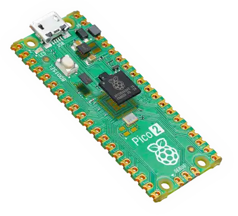

# Pico Pico - 简介

在本书中，我们将使用 Raspberry Pi Pico 2，并使用 Rust 编程来探索各种有趣的项目。你将完成的练习包括：调暗 LED、控制舵机、使用超声波传感器测距、在 OLED 显示屏上显示 Ferris（🦀）图像、使用 RFID 读卡器、用蜂鸣器演奏歌曲、在室内光线不足时点亮 LED、测量温度等。

## 认识硬件 - Pico 2

我们将使用的板子是基于新款 RP2350 芯片的 Raspberry Pi Pico 2。它提供双核灵活性，既支持 ARM Cortex-M33 内核，也可选用 Hazard3 RISC‑V 内核。默认情况下使用 ARM 内核，但开发者可根据需要尝试 RISC‑V 架构。

可在[官方网站](https://www.raspberrypi.com/products/raspberry-pi-pico-2/)查看更详细的信息。

    
    
Raspberry Pi Pico 2

> **注意**：还有一代使用 RP2040 的旧款 Raspberry Pi Pico。本书使用的是更新的 **Pico 2**（搭载 **RP2350**）。购买硬件时请确认型号！

还有一个带 Wi‑Fi 和蓝牙功能的变体 `Pico 2 W`，同样基于 RP2350，但与本书示例并非完全兼容。如希望直接按本书操作而不做额外修改，建议选择标准的非无线版本 Pico 2。

## 可选硬件：Debug Probe

Raspberry Pi Debug Probe 能让向 Pico 2 烧录固件的过程更加便捷。没有调试器时，每次上传新固件都需按住 BOOTSEL 按钮。调试器同时提供完善的调试支持，非常实用。

该工具为可选项。除专门介绍调试器的章节外，本书的其它内容均可在没有调试器的情况下学习。我在刚开始接触 Pico 时也是先不使用调试器，随后才购入。

    
    
Raspberry Pi Pico Debug Probe

**如何选择？**

如果预算有限，可以暂时不购买，因其价格大约为一块 Pico 2 的两倍；若成本不是问题，则非常值得入手。如有第二块 Pico，也可将其配置成低成本的调试器。

## 数据手册

如需更详细的技术信息、规格与指南，请查阅官方数据手册：

- [Pico 2 Datasheet](https://datasheets.raspberrypi.com/pico/pico-2-datasheet.pdf)
- [RP2350 chip Datasheet](https://datasheets.raspberrypi.com/rp2350/rp2350-datasheet.pdf)

## 许可协议

Pico Pico（本项目）按以下许可分发：

* 代码示例及独立的 Cargo 项目同时遵循 [MIT License] 与 [Apache License v2.0]。
* 本书的文字内容遵循 Creative Commons [CC-BY-SA v4.0] 许可协议。

[MIT License]: https://opensource.org/licenses/MIT
[Apache License v2.0]: http://www.apache.org/licenses/LICENSE-2.0
[CC-BY-SA v4.0]: https://creativecommons.org/licenses/by-sa/4.0/legalcode

## 支持本项目

你可以通过在 [GitHub](https://github.com/ImplFerris/pico-pico) 上为该项目加星，或把本书分享给他人来支持它 😊

### 免责声明

本文档中分享的实验与项目均由作者实践验证，但结果可能存在差异。实验过程中产生的任何问题或损坏，作者不承担责任。请谨慎操作并采取必要的安全措施。
