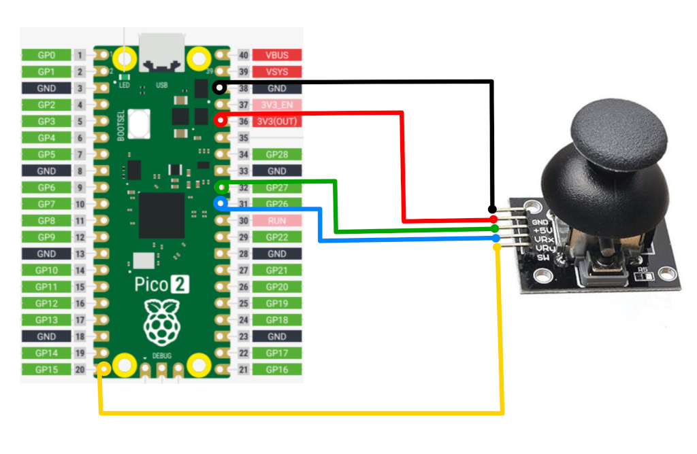

# Connecting the Joystick to the Raspberry Pi Pico

Let's connect the joystick to the Raspberry Pi Pico. We need to connect the VRX and VRY pins to the ADC pins of the Pico. The joystick will be powered with 3.3V instead of 5V because the Pico's GPIO pins are only 3.3V tolerant. Connecting it to 5V could damage the Pico's pins. Thankfully, the joystick can operate at 3.3V as well.

<table>
  <thead>
    <tr>
      <th>Pico Pin</th>
      <th style="width: 250px; margin: 0 auto;">Wire</th>
      <th>Joystick Pin</th>
    </tr>
  </thead>
  <tbody>
    <tr>
      <td>GND</td>
      <td style="text-align: center; vertical-align: middle; padding: 0;">
        

          

          

        

      </td>
      <td>GND</td>
    </tr>
    <tr>
      <td>3.3V</td>
      <td style="text-align: center; vertical-align: middle; padding: 0;">
        

          

          

        

      </td>
      <td>VCC</td>
    </tr>
    <tr>
      <td>GPIO 27 (ADC1)</td>
      <td style="text-align: center; vertical-align: middle; padding: 0;">
        

          

          

        

      </td>
      <td>VRX</td>
    </tr>
    <tr>
      <td>GPIO 26 (ADC0)</td>
      <td style="text-align: center; vertical-align: middle; padding: 0;">
        

          

          

        

      </td>
      <td>VRY</td>
    </tr>
    <tr>
      <td>GPIO 15</td>
      <td style="text-align: center; vertical-align: middle; padding: 0;">
        

          

          

        

      </td>
      <td>SW</td>
    </tr>
  </tbody>
</table>

