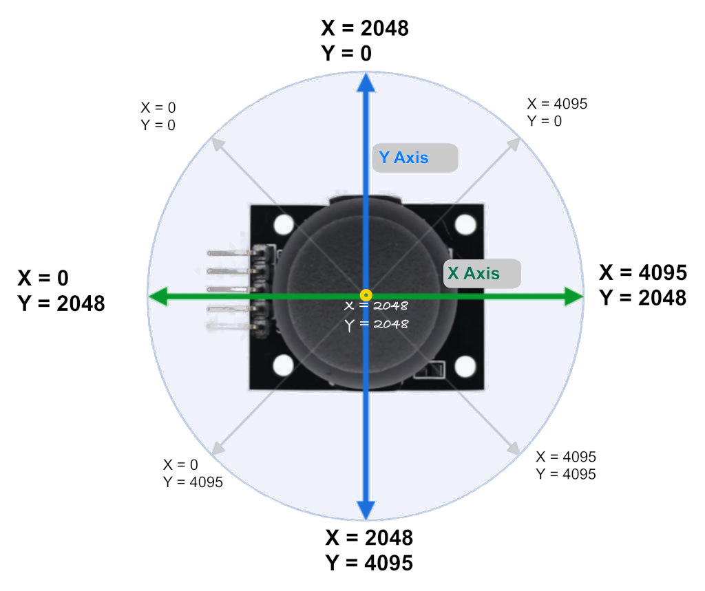

## Joystick Movement and Corresponding ADC Values
When you move the joystick along the X or Y axis, it produces an analog signal with a voltage that varies between 0 and 3.3V(or 5V if we connect it to 5V supply). When the joystick is in its center (rest) position, the output voltage is approximately 1.65V, which is half of the VCC(VCC is 3.3V in our case). 

    <i class="fa-solid fa-info"></i>
    

        <b class="alert-title">Voltage Divider</b>
        
The reason it is 1.65V in the center position is that the potentiometer acts as a voltage divider. When the potentiometer is moved, its resistance changes, causing the voltage divider to output a different voltage accordingly. Refer the <a href="/core-concepts/voltage-divider.html">voltate divider section</a>.

    

The joystick has a total of 5 pins, and we will shortly discuss what each of them represents. Out of these, two pins are dedicated to sending the X and Y axis positions, which should be connected to the ADC pins of the microcontroller.

As you may already know, the Raspberry Pi Pico has a 12-bit SAR-type ADC, which converts analog signals (voltage differences) into digital values. Since it is a 12-bit ADC, the analog values will be represented as digital values ranging from 0 to 4095. If you're not familiar with ADC, refer to the [ADC section](../core-concepts/adc.md) that we covered earlier.

**Note:**

The ADC values in the image are just approximations to give you an idea and won't be exact. For example, I got around 1850 for X and Y at the center position. When I moved the knob toward the pinout side, X went to 0, and when I moved it to the opposite side, it went to 4095. The same applies to the Y axis.So, You might need to calibrate your joystick.
 
