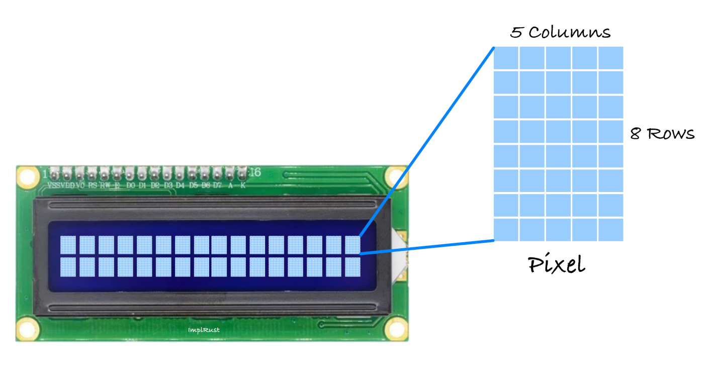

# How it works?

A Liquid Crystal Display (LCD) uses liquid crystals to control light. When electricity is applied, the crystals change orientation, either allowing light to pass through or blocking it, creating images or text. A backlight illuminates the screen, and colored sub-pixels (red, green, and blue) combine to form various colors. The crystals can also turn opaque in specific areas, blocking the backlight and creating dark regions to display characters.

### 16x2 LCD Display and 5x8 Pixel Matrix
A 16x2 LCD has 2 rows and 16 columns, allowing it to display 32 characters in total. Each character is made up of a 5x8 pixel grid, where 5 columns and 8 rows of pixels form the shape of the character. This grid is used to display text and simple symbols on the screen.

### Displaying Text and Custom Characters on 16x2 LCD
We don't have to manually draw the pixels; This is taken care of by the HD44780 IC, which automatically maps ASCII characters to the 5x8 pixel grid.

However, if you'd like to create custom characters or symbols, you will need to define the 5x8 pixel pattern yourself. This pattern is saved in the LCD's memory, and once it's defined, you can use the custom character. Keep in mind, only up to 8 custom characters can be stored at a time.

### Data transfer mode
The LCM (Liquid Crystal Module) supports two types of data transfer modes: 8-bit and 4-bit. In 8-bit mode, data is sent as a full byte using all the data pins. In 4-bit mode, only the higher-order data bits are used, sending data in nibbles. While 8-bit mode is faster, it comes with a trade-off;using too many wires, which can quickly exhaust the GPIO pins on a microcontroller. To minimize wiring, we'll use 4-bit mode.
 

### Reference:
- [16x2 character LCD dot matrix module](http://www.efton.sk/curious/lcd1602.htm)

