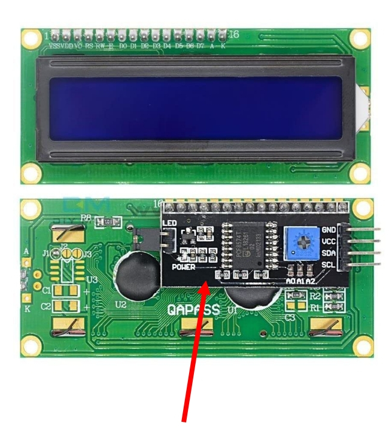

# LCD Display

In this section, we will be using Hitachi HD44780 compatible LCD (Liquid Crystal Display) displays. You might have seen them in devices like printers, digital clocks, microwaves, washing machines, air conditioners, and other home appliances. They're also used in equipment like copiers, fax machines, and routers.

You can display ASCII character and up to 8 custom characters.

## Variants
It comes in various variants, such as 16x2 (16 columns, 2 rows) and 20x4 (20 columns, 4 rows), and also based on backlight color (blue, yellow, or green). The one I have displays white characters with a blue backlight. However, you can choose any variant as it won't significantly affect the code.  Most of these variants will have 16 pins.

### I2C variants
Some variants come with an I2C interface adapter, so you can use I2C for communication. The main advantage of I2C variant is that it reduces the number of pin connections. However, we'll be working with the parallel interface instead.
 
You can also buy the I2C interface adapter separately and solder it later.

## Hardware Requirements
- **LCD Display (LCD1602):** I would recommend getting a 16x2 so you can follow along.  
- **Potentiometer (Optional):** This is used to control the LCD contrast. I didn't have one at the moment, so I used resistors instead.  
- **Resistors (Optional):** Two 1K resistors. If you have a potentiometer, you can ignore this. I used these to control the contrast.  
- **Jump Wires:** A lot! We'll need around 15+ jump wires since we're using a parallel interface (not I2C), which requires connecting many pins.

## Datasheet
- You can access the datasheet for the HD44780 from [Sparkfun](https://www.sparkfun.com/datasheets/LCD/HD44780.pdf) or [MIT site](https://academy.cba.mit.edu/classes/output_devices/44780.pdf)
- [LCD Driver Data Book](https://www.crystalfontz.com/controllers/datasheet-viewer.php?id=433)
- [LCD Module 1602A Datasheet](https://www.openhacks.com/uploadsproductos/eone-1602a1.pdf)
