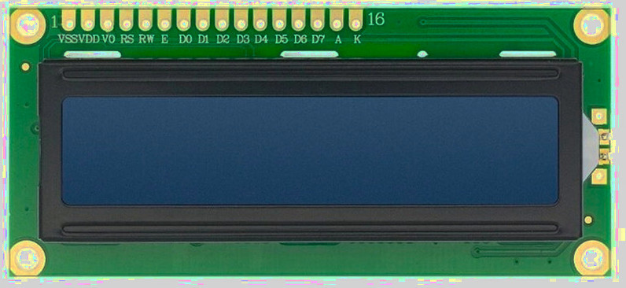

## Pin Layout

The LCD has a total of 16 pins for the parallel interface.

 

 <table border="1" style="border-collapse: collapse; width: 100%;">
  <thead>
    <tr>
      <th>Pin Position</th>
      <th style="width:14%">LCD Pin</th>
      <th>Details</th>
    </tr>
  </thead>
  <tbody>
    <tr>
      <td>1</td>
      <td>VSS</td>
      <td>Should be connected to the Ground.</td>
    </tr>
    <tr>
      <td>2</td>
      <td>VSS</td>
      <td>Power supply (5V) for the logic</td>
    </tr>
    <tr>
      <td>3</td>
      <td>VO</td>
      <td>
        Contrast adjustment: 
        - If you use a potentiometer (10k), connect the middle pin to adjust the contrast. Other pins of the potentiometer should be connected to 5V (or 3.3V) and GND. 
        - I used two 1k resistors instead, which was sufficient for this exercise.
      </td>
    </tr>
    <tr>
      <td>4</td>
      <td>RS</td>
      <td>
        Register select pin: 
        - Set LOW (RS = 0) to send commands to the LCD. 
        - Set HIGH (RS = 1) to send data to the LCD.
      </td>
    </tr>
    <tr>
      <td>5</td>
      <td>RW</td>
      <td>
        Read/Write pin: 
        - Set LOW (RW = 0) to write to the LCD, which is what we will mostly do. 
        - Set HIGH (RW = 1) to read from the LCD (rarely used). 
        - We will connect this to Ground since we’re only writing.
      </td>
    </tr>
    <tr>
      <td>6</td>
      <td>E</td>
      <td>
        The Enable pin is pulsed high and then brought back to low (ground) to trigger the LCD to accept and process data.
      </td>
    </tr>
    <tr>
      <td>7-10</td>
      <td>D0 - D3</td>
      <td>These are the 4 lower-order data bits, used only in 8-bit mode. If you are using 4-bit mode, leave these pins unconnected.</td>
    </tr>
    <tr>
      <td>11-14</td>
      <td>D4 - D7</td>
      <td>These are the 4 higher-order data bits, used to represent the data in 4-bit mode.</td>
    </tr>
    <tr>
      <td>15</td>
      <td>A</td>
      <td>Anode of the backlight. Should be connected to 5V.</td>
    </tr>
    <tr>
      <td>16</td>
      <td>K</td>
      <td>Cathode of the backlight. Should be connected to Ground.</td>
    </tr>
  </tbody>
</table>
 

### Contrast Adjustment
The Vo pin  controls the contrast of the LCD. 

According to the datasheet of the [LCD1602A](https://www.openhacks.com/uploadsproductos/eone-1602a1.pdf), the **Vo** pin controls the contrast of the LCD by adjusting the operating voltage for the LCD, which is the difference between the power supply for the logic (**VDD**) and the contrast control pin (**Vo**). When **Vo** is closer to ground, the voltage difference (**VDD - Vo**) is larger, resulting in a higher contrast, making the text on the screen more distinct and readable. When **Vo** is closer to **VDD**, the voltage difference decreases, resulting in a lower contrast, causing the text to appear faded or less visible.

You can use the potentiometer to adjust the contrast on the fly. You have to connect the middle pin of the potentiometer to Vo, and the other two pins to VCC and Ground.

You can also use resistors to adjust the contrast, which is what I did. You need to adjust the contrast one way or another. The first time I ran the program, I couldn't see the text clearly. I placed two 1k resistors(when I added only one 1k resistor, it didn't look that great) between Ground and the Vo, and then the text became visible.

 
### Register Select Pin (RS)
The Register Select (RS) pin determines whether the LCD is in command mode or data mode. 

When it is in Low(RS = 0), the LCD is in command mode, where the input is interpreted as a command, such as clearing the display or setting the cursor position (e.g., sending a command to clear the display). 

When it is in High(RS = 1), the LCD is in data mode, where the input is interpreted as data to be displayed on the screen (e.g., sending text to display).

### Enable Pin (E)
It is used to control when data is transferred to the LCD display. The enable pin is typically kept low (E=0) but is set high (E=1) for a specific period of time to initiate a data transfer, and then returned to low.. The data is latched into the LCD on the transition from high to low.

