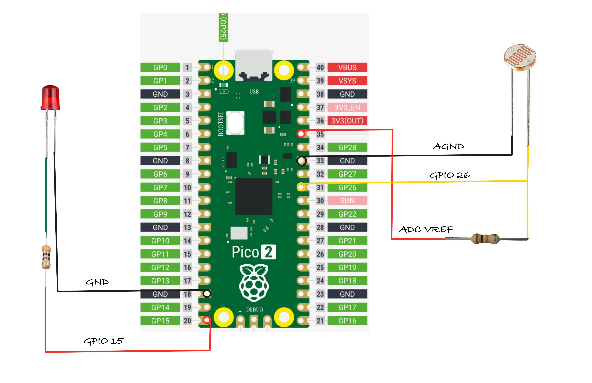

## Turn on LED(or Lamp) in low Light with Pico 

In this exercise, we'll control an LED based on ambient light levels. The goal is to automatically turn on the LED in low light conditions. 

You can try this in a closed room by turning the room light on and off. When you turn off the room-light, the LED should turn on, given that the room is dark enough, and turn off again when the room-light is switched back on. Alternatively, you can adjust the sensitivity threshold or cover the light sensor (LDR) with your hand or some object to simulate different light levels.

Note: You may need to adjust the ADC threshold based on your room's lighting conditions and the specific LDR you are using.

## Setup

## Hardware Requirements

- **LED** – Any standard LED (choose your preferred color).
- **LDR (Light Dependent Resistor)** – Used to detect light intensity.
- **Resistors**
  - **330Ω** – For the LED to limit current and prevent damage. (You might have to choose based on your LED)
  - **10kΩ** – For the LDR, forming a voltage divider in the circuit. (You might have to choose based on your LDR)
- **Jumper Wires** – For connecting components on a breadboard or microcontroller.

## Circuit to connect LED, LDR with Pico 

1. **One side of the LDR** is connected to **AGND** (Analog Ground).
2. The **other side of the LDR** is connected to **GPIO26 (ADC0)**, which is the analog input pin of the pico2
3. A **resistor** is connected in series with the LDR to create a voltage divider between the LDR and **ADC_VREF** (the reference voltage for the ADC).
    - From the datasheet: "ADC_VREF is the ADC power supply (and reference) voltage, and is generated on Pico 2 by filtering the 3.3V supply. This pin can be used with an external reference if better ADC performance is required"

