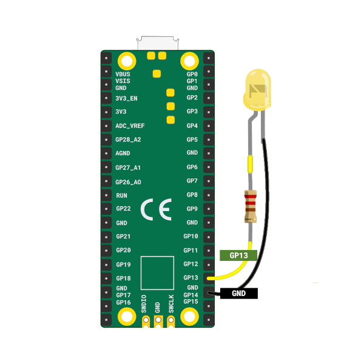

# 闪烁外部 LED

从现在开始，我们将与 Pico 一起使用更多外部部件。在此之前，熟悉简单的电路以及如何将组件连接到 Pico 的引脚会有所帮助。在本章中，我们将从一个基本的东西开始：闪烁连接在电路板外的 LED。

## 硬件需求

- LED
- 电阻
- 跳线

## 组件概述

1. LED：发光二极管（LED）在电流通过时会发光。较长的引脚（阳极）连接到正极，较短的引脚（阴极）连接到地线。我们将阳极连接到 GP13（带电阻），阴极连接到 GND。

2. 电阻：电阻限制电路中的电流，以保护 LED 等组件。其值以欧姆（Ω）计量。我们将使用 330 欧电阻来安全地为 LED 供电。

<table>
  <thead>
    <tr>
      <th>Pico 引脚</th>
      <th style="width: 250px; margin: 0 auto;">导线</th>
      <th>组件</th>
    </tr>
  </thead>
  <tbody>
    <tr>
      <td>GPIO 13</td>
      <td style="text-align: center; vertical-align: middle; padding: 0;">
        

          

          

        

      </td>
      <td>电阻</td>
    </tr>
    <tr>
      <td>电阻</td>
      <td style="text-align: center; vertical-align: middle; padding: 0;">
        

          

          

        

      </td>
      <td>LED 的阳极（长脚）</td>
    </tr>
    <tr>
      <td>GND</td>
      <td style="text-align: center; vertical-align: middle; padding: 0;">
        

          

          

        

      </td>
      <td>LED 的阴极（短脚）</td>
    </tr>
  </tbody>
</table>

你可以使用跳线直接将 Pico 连接到 LED，或者可以在面包板上放置所有东西。如果你对硬件设置不确定，也可以参考 [Raspberry Pi 指南](https://projects.raspberrypi.org/en/projects/introduction-to-the-pico/7)。

    
    
面包板电路

注意：在 Pico 上，引脚标签在电路板的背面，在插入导线时可能会感到不便。我经常需要在想要使用通用输入输出（GPIO）引脚时检查引脚分配图。使用前面的 Raspberry Pi 标志作为参考点，并将其与[引脚分配图](../pico2-pinout.md)相匹配以找到正确的引脚。引脚位置 2 和 39 也印在前面，可以作为额外的参考指南。

## LED 闪烁 - 模拟

在这个模拟中，我将默认延迟设置为 5000 毫秒，以便动画更平缓，更容易跟踪。你可以将其降低到 500 毫秒左右，以看到 LED 闪烁得更快。当我们在 Pico 上运行实际代码时，我们将使用 500 毫秒的延迟。

  

    

      

      
<strong id="led-state">LOW</strong>

    

    

      

        

1

let mut led = Output::new(p.PIN_13, Level::Low);

        

2

loop {

        

3

    led.set_high(); // 打开 LED

        

4

    Timer::after_millis(5000).await;

        

5

    led.set_low(); // 关闭 LED

        

6

    Timer::after_millis(5000).await;

        

7

}

      

        

        

空闲

0 ms

      

      

        <label>间隔（毫秒）：<input id="interval" type="number" value="5000" min="50" step="50"></label>
        <button id="restart">重新开始</button>
        <button id="pause">暂停</button>
        <button id="resume" style="display:none">继续</button>
      

    

  

