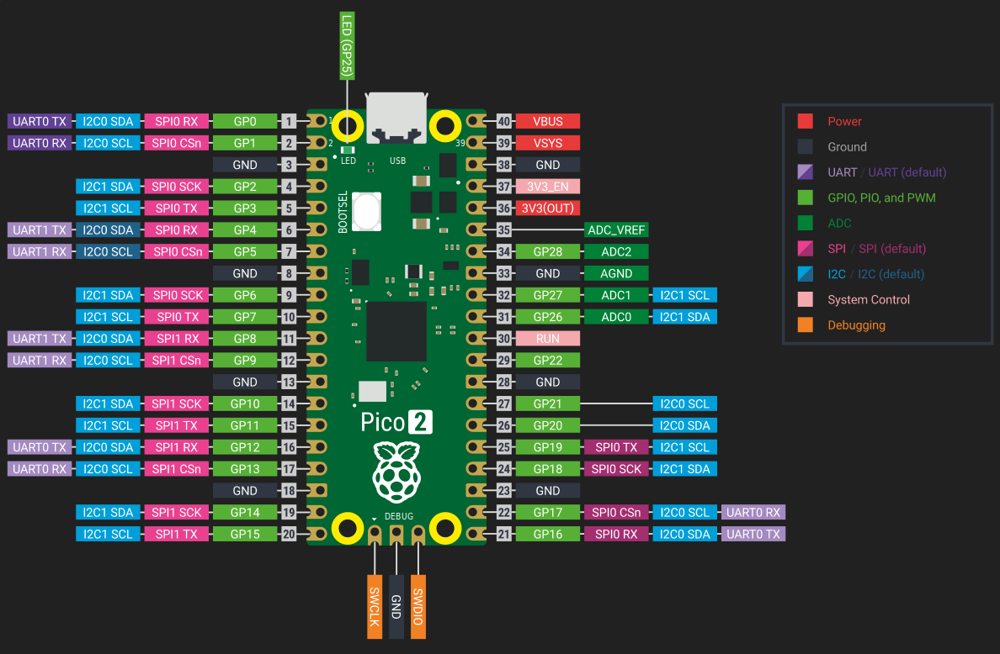

# Raspberry Pi Pico 2 引脚图

> **注意：** 现在无需记住或理解每一个引脚。在完成本书的练习时，我们会随时回到这一节。

## 电源引脚

电源引脚对 Raspberry Pi Pico 2 至关重要，它们既为开发板供电，也为连接的传感器、LED、马达等外设提供电力。

Pico 2 具有如下电源引脚。它们在引脚图中以红色（电源）和黑色（地）标记，可用于为板子或外部器件供电。

- **VBUS** 连接到来自 USB 端口的 5V。当通过 USB 供电时，该引脚大约为 5V。它可用于为小型外设供电，但不适合大电流负载。

- **VSYS** 是板子的主电源输入，可连接电池或稳压电源，电压范围为 1.8V 到 5.5V。该引脚为板载 3.3V 稳压器供电，进而为 RP2350 等部件供电。

- **3V3(OUT)** 提供来自板载稳压器的稳定 3.3V 输出，可用于为传感器或显示屏等外设供电，但建议将电流限制在 300mA 以内。

- **GND** 引脚用于完成电路并连接到系统接地。Pico 2 在板上提供多个 GND 引脚，便于连接外设时接地。

## GPIO 引脚

当你希望微控制器（例如 Pico）与外界交互，如点亮灯、读取按键、感知温度或控制电机时，就需要通过 GPIO 引脚连接这些外部器件。GPIO 引脚就是 Raspberry Pi Pico 2 与外设之间的连接点。

Pico 2 提供 26 个通用输入/输出（GPIO）引脚，标号为 GPIO0 到 GPIO29，尽管并非所有标号都在排针上暴露。这些引脚高度灵活，可用于读取开关或传感器等输入，也可用于控制 LED、马达等输出。

所有 GPIO 的逻辑电平为 3.3V。因此接入的输入信号不应超过 3.3V，否则可能损坏开发板。许多 GPIO 支持基础的数字 I/O，部分引脚还支持模拟输入（ADC），或可配置为 I2C、SPI、UART 等通信线路。

### 引脚编号

每个 GPIO 引脚有两种标识方式：软件中使用的 GPIO 编号和开发板上的物理引脚位置。编写代码时使用 GPIO 编号（例如 GPIO0）；实际连线时需确认该编号对应的物理针脚。

> GPIO25 比较特殊，它连接到板载 LED，可以直接在代码中控制，而无需外接布线。

例如，当代码中引用 GPIO0 时，在硬件上应将导线连接到物理引脚 1；GPIO2 对应物理引脚 4。

## ADC 引脚

Pico 2 上的大多数引脚只能处理简单的开/关信号，适合控制 LED 或读取按钮。但如果你想测量房间亮度以自动点亮灯、监测土壤湿度或读取旋钮转动角度，这些任务需要能够感知连续变化的信号，而非仅有高低电平。

为此，需要使用 ADC（模数转换器）引脚。**ADC**（Analog-to-Digital Converter）会将模拟电压转换为程序可读的数字值。例如 0V 对应 0，3.3V 对应 4095（12 位分辨率的最大值）。本书后文会详细介绍 ADC 的使用。

Pico 2 有三个支持 ADC 的引脚，分别是 GPIO26、GPIO27 和 GPIO28，对应 ADC0、ADC1、ADC2。这些引脚可用于读取光敏、电阻式传感器等模拟信号。

此外还有两个与模拟输入相关的特殊引脚：

- **ADC_VREF** 是 ADC 的参考电压。默认连接到 3.3V，意味着 ADC 会把 0V 到 3.3V 映射到数字范围内；你也可以输入其它参考电压（例如 1.25V）以在特定电压范围内获得更高分辨率。

- **AGND** 是模拟地，用于为模拟信号提供更干净的接地参考，有助于降低噪声并提高测量精度。使用模拟传感器时，建议将其地连接到 AGND 而不是普通 GND。
 
## I2C 引脚

Pico 2 支持 I2C，总线仅需两根线即可连接多个设备，常用于传感器、显示屏等外设。

I2C 使用两条信号线：**SDA**（数据）和 **SCL**（时钟）。所有设备共享这两条线，每个设备有唯一地址，Pico 2 可通过同一对线与多个设备通信。

Pico 2 提供两个 I2C 控制器：I2C0 与 I2C1。每个控制器可以映射到多组 GPIO，引脚选择更灵活。

- **I2C0** 可使用如下 GPIO：
  - SDA（数据）：GPIO0、GPIO4、GPIO8、GPIO12、GPIO16 或 GPIO20
  - SCL（时钟）：GPIO1、GPIO5、GPIO9、GPIO13、GPIO17 或 GPIO21

- **I2C1** 可使用如下 GPIO：
  - SDA（数据）：GPIO2、GPIO6、GPIO10、GPIO14、GPIO18 或 GPIO26
  - SCL（时钟）：GPIO3、GPIO7、GPIO11、GPIO15、GPIO19 或 GPIO27

需从同一控制器中选择匹配的 SDA/SCL 对。

## SPI 引脚

SPI（串行外设接口）是另一种常用通信协议，适合连接显示屏、SD 卡和部分传感器。与 I2C 相比，SPI 使用更多线但速度更快，通常由一个控制器与一个或多个设备通信。

SPI 使用四条主要信号：

- **SCK**（时钟）：控制数据传输节奏；
- **MOSI**（主出从入）：控制器到设备的数据；
- **MISO**（主入从出）：设备返回给控制器的数据；
- **CS/SS**（片选）：由控制器指定要通信的目标设备。

在 Pico 2 的引脚图中，MOSI 标记为 **Tx**，MISO 标记为 **Rx**，CS 标记为 **Csn**。

Pico 2 提供 SPI0 与 SPI1 两个控制器，可映射到多组 GPIO：

- **SPI0** 可使用：
  - SCK：GPIO2、GPIO6、GPIO10、GPIO14、GPIO18
  - MOSI：GPIO3、GPIO7、GPIO11、GPIO15、GPIO19
  - MISO：GPIO0、GPIO4、GPIO8、GPIO12、GPIO16

- **SPI1** 可使用：
  - SCK：GPIO14、GPIO18
  - MOSI：GPIO15、GPIO19
  - MISO：GPIO8、GPIO12、GPIO16

可根据电路布局从同一控制器中选择兼容的一组引脚。CS（片选）不固定，可以使用任意空闲 GPIO。稍后章节会介绍如何配置 SPI 并连接外设。

## UART 引脚

UART（通用异步收发传输器）是最简单的串行通信方式之一，仅需两条主线：

- **TX**（发送）：输出数据；
- **RX**（接收）：输入数据；

UART 常用于连接 GPS 模块、蓝牙适配器或与电脑通信以进行调试。

Pico 2 提供两个 UART 控制器：**UART0** 与 **UART1**。每个控制器都能映射到多组 GPIO，布线更灵活。

- **UART0** 可使用：
  - TX：GPIO0、GPIO12、GPIO16
  - RX：GPIO1、GPIO13、GPIO17

- **UART1** 可使用：
  - TX：GPIO4、GPIO8
  - RX：GPIO5、GPIO9

需成对使用同一 UART 控制器的 TX 与 RX。例如，可选择 UART0 的 GPIO0（TX）和 GPIO1（RX），或 UART1 的 GPIO8（TX）和 GPIO9（RX）。

## SWD 调试引脚

Pico 2 提供专用的 3 针 SWD（Serial Wire Debug）调试接口，这是 ARM 标准的调试方式，能用于刷写固件、查看寄存器、设置断点和实时调试。

该接口包含：
- **SWDIO**：串行数据线
- **SWCLK**：串行时钟线
- **GND**：地参考

这些引脚不与 GPIO 复用，位于板底独立的调试排针上。通常需要借助 Raspberry Pi Debug Probe、CMSIS-DAP 适配器或其它兼容工具（如 OpenOCD、probe-rs）连接这些引脚。

## 板载温度传感器

Pico 2 内置一个温度传感器并内部连接到 **ADC4**。你可以像读取外部模拟传感器一样，通过 ADC 获取芯片温度。

该传感器测量的是 RP2350 芯片本身的温度，在芯片负载较高时可能高于室温，不能准确反映环境温度。

## 控制引脚

这些引脚用于控制开发板的电源行为，可用于复位或关闭芯片。

- **3V3(EN)** 是板载 3.3V 稳压器的使能引脚，将其拉低会关闭 3.3V 电源轨，从而使 RP2350 关闭。

- **RUN** 是 RP2350 的复位引脚，内部有上拉电阻，默认为高电平，拉低即复位芯片。可用于连接物理复位按钮或由其它设备触发复位。
