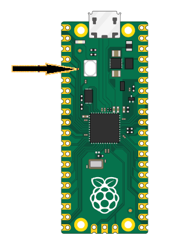

# 快速上手

在详细讲解原理之前，我们先直接动手操作：用一段简单的代码点亮 Pico 2 的板载 LED。

我们将使用 Embassy，这是为像 Raspberry Pi Pico 2 这样的微控制器设计的 Rust 框架。Embassy 允许你编写异步（async）代码，能同时处理多个任务，例如在读取按键的同时让 LED 闪烁，而不会阻塞其他任务的执行。

下面的代码通过在高电平（点亮）和低电平（熄灭）之间切换引脚输出实现闪烁效果。如引脚图所述，Pico 2 的板载 LED 连接在 GPIO25。本程序将该引脚配置为输出（当我们需要控制 LED、驱动电机或向其他设备发送信号时使用输出模式），并把初始状态设为低电平（关闭）。

## 代码片段

此处仅展示 `main` 函数的代码。要让它完整运行，还需引入依赖并完成初始化，这些内容将在下一章深入讲解。现在我们主要体验运行效果。你可以克隆我提供的快速上手项目并立即运行。

> 注意：此代码不适用于 Pico 2 W 版本。Pico 2 W 的 `GPIO25` 用于无线接口控制，若需控制板载 LED，需要采用不同的方法。

```rust
#[embassy_executor::main]
async fn main(_spawner: Spawner) {
    let p = embassy_rp::init(Default::default());

    // 板载 LED 实际上连接在引脚 25
    let mut led = Output::new(p.PIN_25, Level::Low);

    loop {
        led.set_high(); // <- 点亮 LED
        Timer::after_millis(500).await;

        led.set_low(); // <- 熄灭 LED
        Timer::after_millis(500).await;
    }
}
```

## 克隆快速上手项目

```sh
git clone https://github.com/ImplFerris/pico2-quick
cd pico2-quick
```

## 如何运行？

要把程序刷入 Pico 2，请按住 BOOTSEL 按钮，同时使用 Micro USB 数据线将其连接到电脑。USB 插好后即可松开按钮。



```sh
# 运行程序
cargo run
```

该命令会把程序写入 Pico 2 的闪存并自动运行。如果成功，你会看到板载 LED 按固定间隔闪烁。若出现错误，请检查开发环境与硬件连接是否正确；若仍无法解决，请在 GitHub 提交 issue 并附上详细信息，以便我改进本指南。
