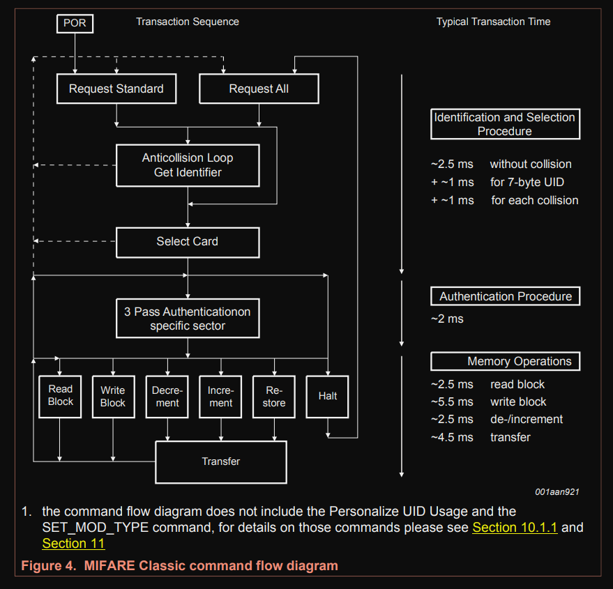

# Flow

When you bring the tag near the reader, it goes into a state where it waits for either a REQA (Request) or WUPA (Wake Up) command.

To check if any tag is nearby, we send the REQA command in a loop. If the tag is nearby, it responds with an ATQA (Answer to Request). 

Once we get the response, we select the card, and it sends back its UID (we won't dive into the full technical details involved in this process). After that, we authenticate the sector we want to read or write from. Once we're done with our operation, we send a HLTA command to put the card in the HALT state.

Note: Once the card is in the HALT state, only the WUPA command (reminds me of Chandler from Friends saying "WOOPAAH") can wake it up and let us do more operations.

 