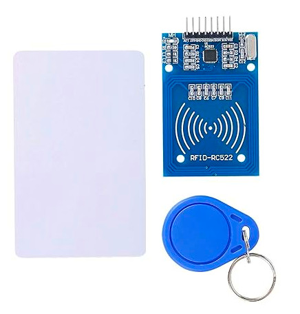

# Meet the module

We will be using the RC522 RFID Card Reader Module, which is built on the MFRC522 IC (designed by NXP), operates at 13.56 MHz . This module is widely available online at an affordable price and typically comes with an RFID tag (MIFARE Classic 1K) and key fob, each containing 1KB of memory. MFRC522 Datasheet can be found [here](https://www.nxp.com/docs/en/data-sheet/MFRC522.pdf).

The microcontroller can communicate with the reader using SPI, UART, I2C. It also has an IRQ (Interrupt Request) pin that can trigger interrupts, so the microcontroller(pico) knows when the tag is nearby, instead of constantly asking the reader (kind of like "Are we there yet?").

Unfortunately, the library we're going to use doesn't support this feature yet, so we won't be using it for now. We'll update this section once support is added. So, are we there yet?

### Additional Information about the Module:
- **Supported Standards**: ISO/IEC 14443 A / MIFARE 
- **Card Reading Distance**: 0~50 mm 
- **Idle Current**: 10–13 mA  
- **Operating Current**: 13–26 mA  
- **Operating Voltage**: DC 3.3V  (⚠️ Do not use 5V or higher, it will cause damage).
