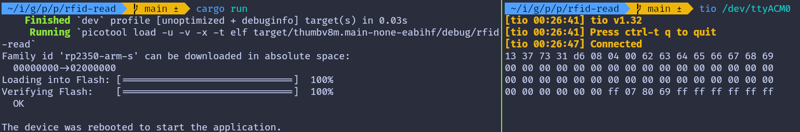

# Read the data

In this section, we'll read all the blocks from the first sector (sector 0). As we mentioned earlier, to read or write to a specific block on the RFID tag, we first need to authenticate with the corresponding sector.

## Authentication
Most tags come with a default key, typically 0xFF repeated six times. You may need to check the documentation to find the default key or try other common keys. For the RFID reader we are using, the default key is 0xFF repeated six times.

For authentication, we need:
- The tag's UID (obtained using the REQA and Select commands).
- The block number within the sector.
- The key (hardcoded in this case). 

## Read the block
After successful authentication, we can read data from each block using the `mf_read` function from the mfrc522 crate. If the read operation succeeds, the function returns 16 bytes of data from the block. This data will then be converted into a hex string and sent to the USB serial output.

The first sector (sector 0) consists of 4 blocks, with absolute block numbers ranging from 0 to 3. For higher sectors, the absolute block numbers increase accordingly (e.g., for sector 1, the blocks are 4, 5, 6, 7).

```rust
fn read_sector<E, COMM: mfrc522::comm::Interface<Error = E>, B: UsbBus>(
    uid: &mfrc522::Uid,
    sector: u8,
    rfid: &mut Mfrc522<COMM, mfrc522::Initialized>,
    serial: &mut SerialPort<B>,
) -> Result<(), &'static str> {
    const AUTH_KEY: [u8; 6] = [0xFF; 6];

    let block_offset = sector * 4;
    rfid.mf_authenticate(uid, block_offset, &AUTH_KEY)
        .map_err(|_| "Auth failed")?;

    for abs_block in block_offset..block_offset + 4 {
        let data = rfid.mf_read(abs_block).map_err(|_| "Read failed")?;
        print_hex_to_serial(&data, serial);
        serial
            .write("\r\n".as_bytes())
            .map_err(|_| "Write failed")?;
    }
    Ok(())
}
```
 
## The main loop
The main loop operates similarly to what we covered in the previous chapter. After selecting a tag, we proceed to read its blocks. Once the block data is read, the loop sends the HLTA and stop_crypto1 commands to put the card in HALT state.

```rust
    loop {
        let _ = usb_dev.poll(&mut [&mut serial]);

        if let Ok(atqa) = rfid.reqa() {
            if let Ok(uid) = rfid.select(&atqa) {
                if let Err(e) = read_sector(&uid, 0, &mut rfid, &mut serial) {
                    serial.write(e.as_bytes()).unwrap();
                }
                rfid.hlta().unwrap();
                rfid.stop_crypto1().unwrap();
            }
        }
    }
```


## Clone the existing project
You can clone (or refer) project I created and navigate to the `rfid-read` folder.

```sh
git clone https://github.com/ImplFerris/pico2-rp-projects
cd pico2-projects/rfid-read/
```

## How to Run ?
The method to flash (run the code) on the Pico is the same as usual. However, we need to set up tio to interact with the Pico through the serial port (/dev/ttyACM0). This allows us to read data from the Pico or send data to it.
  
### Connecting to the Serial Port
Run the following command to connect to the Pico's serial port:

```sh
tio /dev/ttyACM0
```
This will open a terminal session for communicating with the Pico.

### Flashing and Running the Code
Open another terminal, navigate to the project folder, and flash the code onto the Pico as usual:
```sh
cargo run
```
If everything is set up correctly, you should see a "Connected" message in the tio terminal.

### Reading the UID
Bring the RFID tag close to the reader, and the USB serial terminal will display the data bytes read from the blocks of the first sector (sector 0).
 



