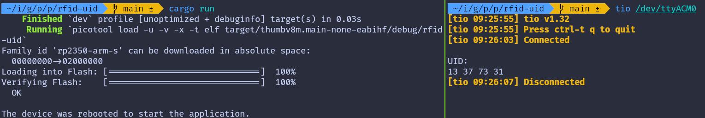

# Read UID

Alright, let's get to the fun part and dive into some action! We'll start by writing a simple program to read the UID of the RFID tag.

### mfrc522 Driver
We will be using the awesome crate  "[mfrc522](https://crates.io/crates/mfrc522)". It is still under development. However, it has everything what we need for purposes.

### USB Serial
To display the tag data, we'll use USB serial, which we covered in the last chapter. This will allow us to read from the RFID tag and display the UID on the computer.

### Project from template

To set up the project, run:
```sh
cargo generate --git https://github.com/ImplFerris/pico2-template.git --tag v0.1.0
```
When prompted, give your project a name, like "rfid-uid" and select `RP-HAL` as the HAL.

Then, navigate into the project folder:
```sh
cd PROJECT_NAME
# For example, if you named your project "rfid-uid":
# cd rfid-uid
```

### Additional Crates required
Update your Cargo.toml to add these additional crate along with the existing dependencies.
```rust
usbd-serial = "0.2.2"
usb-device = "0.3.2"
heapless = "0.8.0"
mfrc522 = "0.8.0"
embedded-hal-bus = "0.2.0"
```
We have added embedded-hal-bus, which provides the necessary traits for SPI and I2C buses. This is required for interfacing the Pico with the RFID reader.


### Additional imports
```rust
use hal::fugit::RateExtU32;
use core::fmt::Write;

// to prepare buffer with data before writing into USB serial
use heapless::String;

// for setting up USB Serial
use usb_device::{class_prelude::*, prelude::*};
use usbd_serial::SerialPort;

// Driver for the MFRC522
use mfrc522::{comm::blocking::spi::SpiInterface, Mfrc522};

use embedded_hal_bus::spi::ExclusiveDevice;
```

Make sure to check out the [USB serial](../usb-serial/action.md) tutorial for setting up the USB serial. We won't go over the setup here to keep it simple.


### Helper Function to Print UID in Hex

We'll use this helper function to convert the u8 byte array (in this case UID) into a printable hex string.  You could also just use raw bytes and enable hex mode in tio(requires latest version) or minicom, but I find this approach easier. In hex mode, it prints everything in hex, including normal text. 

```rust
fn print_hex_to_serial<B: UsbBus>(data: &[u8], serial: &mut SerialPort<B>) {
    let mut buff: String<64> = String::new();
    for &d in data.iter() {
        write!(buff, "{:02x} ", d).unwrap();
    }
    serial.write(buff.as_bytes()).unwrap();
}
```

### Setting Up the SPI for the RFID Reader
Now, let's configure the SPI bus and the necessary pins to communicate with the RFID reader.

```rust
let spi_mosi = pins.gpio7.into_function::<hal::gpio::FunctionSpi>();
let spi_miso = pins.gpio4.into_function::<hal::gpio::FunctionSpi>();
let spi_sclk = pins.gpio6.into_function::<hal::gpio::FunctionSpi>();
let spi_bus = hal::spi::Spi::<_, _, _, 8>::new(pac.SPI0, (spi_mosi, spi_miso, spi_sclk));
let spi_cs = pins.gpio5.into_push_pull_output();
let spi = spi_bus.init(
    &mut pac.RESETS,
    clocks.peripheral_clock.freq(),
    1_000.kHz(),
    embedded_hal::spi::MODE_0,
);
```

### Getting the `SpiDevice` from SPI Bus
To work with the `mfrc522` crate, we need an `SpiDevice`. Since we only have the SPI bus from RP-HAL, we'll use the `embedded_hal_bus` crate to get the `SpiDevice` from the SPI bus.

```rust
let spi = ExclusiveDevice::new(spi, spi_cs, timer).unwrap();
```

### Initialize the mfrc522
```rust
let itf = SpiInterface::new(spi);
let mut rfid = Mfrc522::new(itf).init().unwrap();
```

### Read the UID and Print
The main logic for reading the UID is simple. We continuously send the REQA command. If a tag is present, it send us the ATQA response. We then use this response to select the tag and retrieve the UID.
 
Once we have the UID, we use our helper function to print the UID bytes in hex format via USB serial.

```rust
loop {
    // to estabilish USB serial
    let _ = usb_dev.poll(&mut [&mut serial]);

    if let Ok(atqa) = rfid.reqa() {
        if let Ok(uid) = rfid.select(&atqa) {
            serial.write("\r\nUID: \r\n".as_bytes()).unwrap();
            print_hex_to_serial(uid.as_bytes(), &mut serial);
            timer.delay_ms(500);
        }
    }
}
```


## Clone the existing project
You can clone (or refer) project I created and navigate to the `rfid-uid` folder.

```sh
git clone https://github.com/ImplFerris/pico2-rp-projects
cd pico2-projects/rfid-uid/
```

## How to Run ?
The method to flash (run the code) on the Pico is the same as usual. However, we need to set up tio to interact with the Pico through the serial port (/dev/ttyACM0). This allows us to read data from the Pico or send data to it.

### tio
Make sure you have tio installed on your system. If not, you can install it using:
```sh
apt install tio
```

### Connecting to the Serial Port
Run the following command to connect to the Pico's serial port:

```sh
tio /dev/ttyACM0
```
This will open a terminal session for communicating with the Pico.

### Flashing and Running the Code
Open another terminal, navigate to the project folder, and flash the code onto the Pico as usual:
```sh
cargo run
```
If everything is set up correctly, you should see a "Connected" message in the tio terminal.

### Reading the UID
Now, bring the RFID tag near the reader. You should see the UID bytes displayed in hex format on the USB serial terminal.
 


