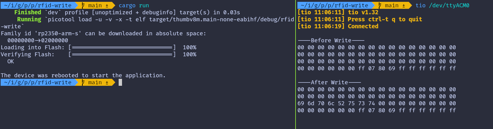

# Write Data

We will write data into block 2 of sector 4. First, we will print the data in the block before writing to it, and then again after writing. To perform the write operation, we will use the `mf_write` function from the mfrc522 crate.

<div class="alert-box alert-box-danger">
    <span class="icon"><i class="fa-solid fa-bolt"></i></span>
    <div class="alert-content">
        <b class="alert-title">Writing trailer block</b>
        <p>Accidentally writing to the wrong block and overwriting the trailer block may alter the authentication key or access bits, which could make the sector unusable.</p>
    </div>
</div>


## Write function
We will use this function to write data to the block. The mf_write function requires the absolute block number, which we will calculate using the sector number and its relative block number.

```rust
fn write_block<E, COMM: mfrc522::comm::Interface<Error = E>>(
    uid: &mfrc522::Uid,
    sector: u8,
    rel_block: u8,
    data: [u8; 16],
    rfid: &mut Mfrc522<COMM, mfrc522::Initialized>,
) -> Result<(), &'static str> {
    const AUTH_KEY: [u8; 6] = [0xFF; 6];

    let block_offset = sector * 4;
    let abs_block = block_offset + rel_block;

    rfid.mf_authenticate(uid, block_offset, &AUTH_KEY)
        .map_err(|_| "Auth failed")?;

    rfid.mf_write(abs_block, data).map_err(|_| "Write failed")?;

    Ok(())
}
```

## The main loop
The main loop begins by reading and printing the current content of a specified block before writing new data to it. The `write_block` function is used to write the constant DATA, which must fill the entire 16-byte block. Any unused bytes are padded with null bytes (0x00).

```rust
    let target_sector = 4;
    let rel_block = 2;
    const DATA: [u8; 16] = [
        b'i', b'm', b'p', b'l', b'R', b'u', b's', b't', // "implRust"
        0x00, 0x00, 0x00, 0x00, 0x00, 0x00, 0x00, 0x00, // Remaining bytes as 0x00
    ];

    loop {
        let _ = usb_dev.poll(&mut [&mut serial]);

        if let Ok(atqa) = rfid.reqa() {
            if let Ok(uid) = rfid.select(&atqa) {
                serial
                    .write("\r\n----Before Write----\r\n".as_bytes())
                    .unwrap();
                if let Err(e) = read_sector(&uid, target_sector, &mut rfid, &mut serial) {
                    serial.write(e.as_bytes()).unwrap();
                }

                if let Err(e) = write_block(&uid, target_sector, rel_block, DATA, &mut rfid) {
                    serial.write(e.as_bytes()).unwrap();
                }

                serial
                    .write("\r\n----After Write----\r\n".as_bytes())
                    .unwrap();
                if let Err(e) = read_sector(&uid, target_sector, &mut rfid, &mut serial) {
                    serial.write(e.as_bytes()).unwrap();
                }
                rfid.hlta().unwrap();
                rfid.stop_crypto1().unwrap();
            }
        }
    }
```

## Clone the existing project
You can clone (or refer) project I created and navigate to the `rfid-write` folder.

```sh
git clone https://github.com/ImplFerris/pico2-rp-projects
cd pico2-projects/rfid-write/
```

## Output
When you run the program, the output will display the hex representation of "implRust" visible in the third row.

