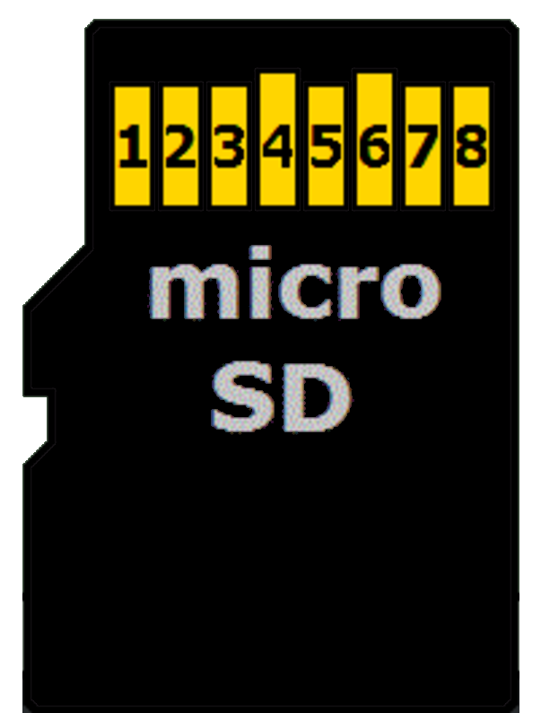

## Circuit

### microSD Card Pin Mapping for SPI Mode

We'll focus only on the microSD card since that's what we're using. The microSD has 8 pins, but we only need 6 for SPI mode. You may have noticed that the SD card reader module we have also has only 6 pins, with markings for the SPI functions. The table below shows the microSD card pins and their corresponding SPI functions.
 

  
  <table>
    <thead>
      <tr>
        <th>microSD Card Pin</th>
        <th>SPI Function</th>
      </tr>
    </thead>
    <tbody>
      <tr>
        <td>1</td>
        <td>-</td>
      </tr>
      <tr>
        <td>2</td>
        <td>Chip Select (CS); also referred as Card Select</td>
      </tr>
      <tr>
        <td>3</td>
        <td>Data Input (DI) - corresponds to MOSI. To receive data from the microcontroller.</td>
      </tr>
      <tr>
        <td>4</td>
        <td>VDD - Power supply (3.3V)</td>
      </tr>
      <tr>
        <td>5</td>
        <td>Serial Clock (SCK)</td>
      </tr>
      <tr>
        <td>6</td>
        <td>Ground (GND)</td>
      </tr>
      <tr>
        <td>7</td>
        <td>Data Output (DO) - corresponds to MISO. To send data from the microSD card to the microcontroller.</td>
      </tr>
      <tr>
        <td>8</td>
        <td>-</td>
      </tr>
    </tbody>
  </table>

### Connecting the Raspberry Pi Pico to the SD Card Reader

The microSD card operates at 3.3V, so using 5V to power it could damage the card. However, the reader module comes with an onboard voltage regulator and logic shifter, allowing it to safely be connected to the 5V power supply of the Pico.
 
<table>
  <thead>
    <tr>
      <th>Pico Pin</th>
      <th style="width: 250px; margin: 0 auto;">Wire</th>
      <th>SD Card Pin</th>
    </tr>
  </thead>
  <tbody>
    <tr>
      <td>GPIO 1</td>
      <td style="text-align: center; vertical-align: middle; padding: 0;">
        

          

          

        

      </td>
      <td>CS</td>
    </tr>
    <tr>
      <td>GPIO 2</td>
      <td style="text-align: center; vertical-align: middle; padding: 0;">
        

          

          

        

      </td>
      <td>SCK</td>
    </tr>
    <tr>
      <td>GPIO 3</td>
      <td style="text-align: center; vertical-align: middle; padding: 0;">
        

          

          

        

      </td>
      <td>MOSI</td>
    </tr>
    <tr>
      <td>GPIO 4</td>
      <td style="text-align: center; vertical-align: middle; padding: 0;">
        

          

          

        

      </td>
      <td>MISO</td>
    </tr>
        <tr>
      <td>5V</td>
      <td style="text-align: center; vertical-align: middle; padding: 0;">
        

          

          

        

      </td>
      <td>VCC</td>
    </tr>
    <tr>
      <td>GND</td>
      <td style="text-align: center; vertical-align: middle; padding: 0;">
        

          

          

        

      </td>
      <td>GND</td>
    </tr>
  </tbody>
</table>
 

