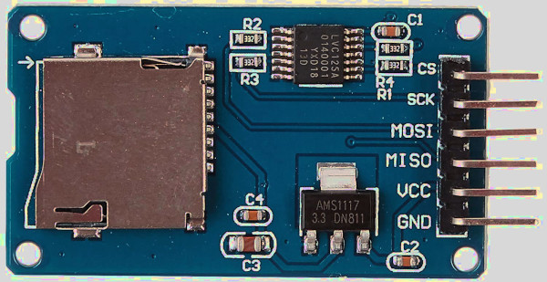

# SD Card (SDC/MMC)

In this section, we will explore how to use the SD Card reader module. Depending on your project, you can use the SD card to store collected data from sensors, save game ROMs and progress, or store other types of information.

 
## MMC
The MultiMediaCard (MMC) was introduced as an early type of flash memory storage, preceding the SD Card. It was commonly used in devices such as camcorders, digital cameras, and portable music players. MMCs store data as electrical charges in flash memory cells, unlike optical disks, which rely on laser-encoded data on reflective surfaces.

## SD (Secure Digital) Card
The Secure Digital Card (SDC), commonly referred to as an SD Card, is an evolution of the MMC. SD Cards are widely used as external storage in electronic devices such as cameras, smartphones.  A smaller variant, the microSD card, is commonly used in smartphones, drones, and other devices.

Image credit: Based on <a href="https://en.wikipedia.org/wiki/File:SD_Cards.svg">SD card</a> by <a href="https://commons.wikimedia.org/wiki/User:Tkgd2007">Tkgd2007</a>, licensed under the GFDL and CC BY-SA 3.0, 2.5, 2.0, 1.0.

SD cards read and write data in blocks, typically 512 bytes in size, allowing them to function as block devices; this makes SD cards behave much like hard drives.

## Protocol
To communicate with an SD card, we can use the SD Bus protocol, SPI protocol, or UHS-II Bus protocol. The Raspberry Pi (but not the Raspberry Pi Pico) uses the SD Bus protocol, which is more complex than SPI. The full specs of the SD Bus protocol are not accessible to the public and are only available through the SD Association. We will be using the SPI protocol, as the Rust driver we will be using is designed to work with it.

## Hardware Requirements
We'll be using the Micro SD Card adapter module. You can search for either "Micro SD Card Reader Module" or "Micro SD Card Adapter" to find them.
 

 
And of course, you'll need a microSD card. The SD card should be formatted with FAT32; Depending on your computer's hardware, you might need a separate SD card adapter (not the one mentioned above) to format the microSD card. Some laptops comes with direct microSD card support.

## References:

- I highly recommend watching Jonathan Pallant's [talk](https://www.youtube.com/watch?v=-ewuFNKIAVI) at Euro Rust 2024 on writing an SD card driver in Rust.  He wrote the driver we are going to use (originally he created it to run MS-DOS on ARM). It is not intended for production systems.
- If you want to understand how it works under the hood in SPI mode, you can refer to this article: [How to Use MMC/SDC](http://elm-chan.org/docs/mmc/mmc_e.html)
- [Wikipedia](https://en.wikipedia.org/wiki/SD_card)
