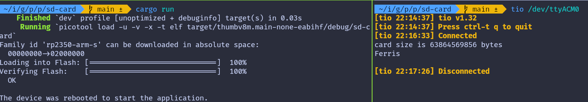

# Read SD Card with Raspberry Pi Pico

Let's create a simple program that reads a file from the SD card and outputs its content over USB serial. Make sure the SD card is formatted with FAT32 and contains a file to read (for example, "RUST.TXT" with the content "Ferris"). 
 
### Project from template

To set up the project, run:
```sh
cargo generate --git https://github.com/ImplFerris/pico2-template.git --tag v0.1.0
```
When prompted, give your project a name, like "read-sdcard" and select `RP-HAL` as the HAL.

Then, navigate into the project folder:
```sh
cd PROJECT_NAME
# For example, if you named your project "read-sdcard":
# cd read-sdcard
```

### Additional Crates required
Update your Cargo.toml to add these additional crate along with the existing dependencies.

```rust
// USB serial communication
usbd-serial = "0.2.2"
usb-device = "0.3.2"
heapless = "0.8.0"

// To convert Spi bus to SpiDevice
embedded-hal-bus = "0.2.0"

// sd card driver
embedded-sdmmc = "0.8.1"
```
Except for the embedded-sdmmc crate, we have already used all these crates in previous exercises. 

- The usbd-serial and usb-device crates are used for sending or receiving data to and from a computer via USB serial. The heapless crate acts as a helper, providing a buffer before printing data to USB serial. 
- The embedded-hal-bus crate offers the necessary traits for SPI and I²C buses, which are essential for interfacing the Pico with the SD card reader.  
- The embedded-sdmmc crate is a driver for reading and writing files on FAT-formatted SD cards.

 ### Additional imports

 ```rust
use usb_device::{class_prelude::*, prelude::*};
use usbd_serial::SerialPort;

use hal::fugit::RateExtU32;
use heapless::String;

use core::fmt::Write;

use embedded_hal_bus::spi::ExclusiveDevice;
use embedded_sdmmc::{SdCard, TimeSource, Timestamp, VolumeIdx, VolumeManager};
```

Make sure to check out the [USB serial](../usb-serial/action.md) tutorial for setting up the USB serial. We won't go over the setup here to keep it simple.


### Dummy Timesource 
The TimeSource is needed to retrieve timestamps and manage file metadata. Since we won't be using this functionality, we'll create a DummyTimeSource that implements the TimeSource trait. This is necessary for compatibility with the embedded-sdmmc crate.


```rust
/// Code from https://github.com/rp-rs/rp-hal-boards/blob/main/boards/rp-pico/examples/pico_spi_sd_card.rs
/// A dummy timesource, which is mostly important for creating files.
#[derive(Default)]
pub struct DummyTimesource();

impl TimeSource for DummyTimesource {
    // In theory you could use the RTC of the rp2040 here, if you had
    // any external time synchronizing device.
    fn get_timestamp(&self) -> Timestamp {
        Timestamp {
            year_since_1970: 0,
            zero_indexed_month: 0,
            zero_indexed_day: 0,
            hours: 0,
            minutes: 0,
            seconds: 0,
        }
    }
}
```

### Setting Up the SPI for the SD Card Reader
Now, let's configure the SPI bus and the necessary pins to communicate with the SD Card reader.

```rust
let spi_cs = pins.gpio1.into_push_pull_output();
let spi_sck = pins.gpio2.into_function::<hal::gpio::FunctionSpi>();
let spi_mosi = pins.gpio3.into_function::<hal::gpio::FunctionSpi>();
let spi_miso = pins.gpio4.into_function::<hal::gpio::FunctionSpi>();
let spi_bus = hal::spi::Spi::<_, _, _, 8>::new(pac.SPI0, (spi_mosi, spi_miso, spi_sck));

let spi = spi_bus.init(
    &mut pac.RESETS,
    clocks.peripheral_clock.freq(),
    400.kHz(), // card initialization happens at low baud rate
    embedded_hal::spi::MODE_0,
);

```

### Getting the `SpiDevice` from SPI Bus
To work with the embedded-sdmmc crate, we need an `SpiDevice`. Since we only have the SPI bus from RP-HAL, we'll use the `embedded_hal_bus` crate to get the `SpiDevice` from the SPI bus.

```rust
let spi = ExclusiveDevice::new(spi, spi_cs, timer).unwrap();
```

### Setup SD Card driver

```rust
let sdcard = SdCard::new(spi, timer);
let mut volume_mgr = VolumeManager::new(sdcard, DummyTimesource::default());
```
###  Print the size of the SD Card

```rust
match volume_mgr.device().num_bytes() {
    Ok(size) => {
        write!(buff, "card size is {} bytes\r\n", size).unwrap();
        serial.write(buff.as_bytes()).unwrap();
    }
    Err(e) => {
        write!(buff, "Error: {:?}", e).unwrap();
        serial.write(buff.as_bytes()).unwrap();
    }
}
```

### Open the directory
Let's open the volume with the volume manager then open the root directory.

```rust
let Ok(mut volume0) = volume_mgr.open_volume(VolumeIdx(0)) else {
    let _ = serial.write("err in open_volume".as_bytes());
    continue;
};

let Ok(mut root_dir) = volume0.open_root_dir() else {
    serial.write("err in open_root_dir".as_bytes()).unwrap();
    continue;
};
```

### Open the file in read-only mode
```rust
let Ok(mut my_file) =  root_dir.open_file_in_dir("RUST.TXT", embedded_sdmmc::Mode::ReadOnly) else {
    serial.write("err in open_file_in_dir".as_bytes()).unwrap();
    continue;
};
```

### Read the file content and print
```rust
while !my_file.is_eof() {
    let mut buffer = [0u8; 32];
    let num_read = my_file.read(&mut buffer).unwrap();
    for b in &buffer[0..num_read] {
        write!(buff, "{}", *b as char).unwrap();
    }
}
serial.write(buff.as_bytes()).unwrap();
```

## Full code
```rust
#![no_std]
#![no_main]

use embedded_hal::delay::DelayNs;
use hal::block::ImageDef;
use panic_halt as _;
use rp235x_hal::{self as hal, Clock};

use usb_device::{class_prelude::*, prelude::*};
use usbd_serial::SerialPort;

use hal::fugit::RateExtU32;
use heapless::String;

use core::fmt::Write;

use embedded_hal_bus::spi::ExclusiveDevice;
use embedded_sdmmc::{SdCard, TimeSource, Timestamp, VolumeIdx, VolumeManager};

#[link_section = ".start_block"]
#[used]
pub static IMAGE_DEF: ImageDef = hal::block::ImageDef::secure_exe();

const XTAL_FREQ_HZ: u32 = 12_000_000u32;

/// A dummy timesource, which is mostly important for creating files.
#[derive(Default)]
pub struct DummyTimesource();

impl TimeSource for DummyTimesource {
    // In theory you could use the RTC of the rp2040 here, if you had
    // any external time synchronizing device.
    fn get_timestamp(&self) -> Timestamp {
        Timestamp {
            year_since_1970: 0,
            zero_indexed_month: 0,
            zero_indexed_day: 0,
            hours: 0,
            minutes: 0,
            seconds: 0,
        }
    }
}

#[hal::entry]
fn main() -> ! {
    let mut pac = hal::pac::Peripherals::take().unwrap();
    let mut watchdog = hal::Watchdog::new(pac.WATCHDOG);

    let clocks = hal::clocks::init_clocks_and_plls(
        XTAL_FREQ_HZ,
        pac.XOSC,
        pac.CLOCKS,
        pac.PLL_SYS,
        pac.PLL_USB,
        &mut pac.RESETS,
        &mut watchdog,
    )
    .ok()
    .unwrap();
    let mut timer = hal::Timer::new_timer0(pac.TIMER0, &mut pac.RESETS, &clocks);

    let sio = hal::Sio::new(pac.SIO);
    let pins = hal::gpio::Pins::new(
        pac.IO_BANK0,
        pac.PADS_BANK0,
        sio.gpio_bank0,
        &mut pac.RESETS,
    );

    let usb_bus = UsbBusAllocator::new(hal::usb::UsbBus::new(
        pac.USB,
        pac.USB_DPRAM,
        clocks.usb_clock,
        true,
        &mut pac.RESETS,
    ));

    let mut serial = SerialPort::new(&usb_bus);

    let mut usb_dev = UsbDeviceBuilder::new(&usb_bus, UsbVidPid(0x16c0, 0x27dd))
        .strings(&[StringDescriptors::default()
            .manufacturer("implRust")
            .product("Ferris")
            .serial_number("TEST")])
        .unwrap()
        .device_class(2) // 2 for the CDC, from: https://www.usb.org/defined-class-codes
        .build();

    let spi_cs = pins.gpio1.into_push_pull_output();
    let spi_sck = pins.gpio2.into_function::<hal::gpio::FunctionSpi>();
    let spi_mosi = pins.gpio3.into_function::<hal::gpio::FunctionSpi>();
    let spi_miso = pins.gpio4.into_function::<hal::gpio::FunctionSpi>();
    let spi_bus = hal::spi::Spi::<_, _, _, 8>::new(pac.SPI0, (spi_mosi, spi_miso, spi_sck));

    let spi = spi_bus.init(
        &mut pac.RESETS,
        clocks.peripheral_clock.freq(),
        400.kHz(), // card initialization happens at low baud rate
        embedded_hal::spi::MODE_0,
    );

    let spi = ExclusiveDevice::new(spi, spi_cs, timer).unwrap();
    let sdcard = SdCard::new(spi, timer);
    let mut buff: String<64> = String::new();

    let mut volume_mgr = VolumeManager::new(sdcard, DummyTimesource::default());

    let mut is_read = false;
    loop {
        let _ = usb_dev.poll(&mut [&mut serial]);
        if !is_read && timer.get_counter().ticks() >= 2_000_000 {
            is_read = true;
            serial
                .write("Init SD card controller and retrieve card size...".as_bytes())
                .unwrap();
            match volume_mgr.device().num_bytes() {
                Ok(size) => {
                    write!(buff, "card size is {} bytes\r\n", size).unwrap();
                    serial.write(buff.as_bytes()).unwrap();
                }
                Err(e) => {
                    write!(buff, "Error: {:?}", e).unwrap();
                    serial.write(buff.as_bytes()).unwrap();
                }
            }
            buff.clear();

            let Ok(mut volume0) = volume_mgr.open_volume(VolumeIdx(0)) else {
                let _ = serial.write("err in open_volume".as_bytes());
                continue;
            };

            let Ok(mut root_dir) = volume0.open_root_dir() else {
                serial.write("err in open_root_dir".as_bytes()).unwrap();
                continue;
            };

            let Ok(mut my_file) =
                root_dir.open_file_in_dir("RUST.TXT", embedded_sdmmc::Mode::ReadOnly)
            else {
                serial.write("err in open_file_in_dir".as_bytes()).unwrap();
                continue;
            };

            while !my_file.is_eof() {
                let mut buffer = [0u8; 32];
                let num_read = my_file.read(&mut buffer).unwrap();
                for b in &buffer[0..num_read] {
                    write!(buff, "{}", *b as char).unwrap();
                }
            }
            serial.write(buff.as_bytes()).unwrap();
        }
        buff.clear();

        timer.delay_ms(50);
    }
}

#[link_section = ".bi_entries"]
#[used]
pub static PICOTOOL_ENTRIES: [hal::binary_info::EntryAddr; 5] = [
    hal::binary_info::rp_cargo_bin_name!(),
    hal::binary_info::rp_cargo_version!(),
    hal::binary_info::rp_program_description!(c"USB Fun"),
    hal::binary_info::rp_cargo_homepage_url!(),
    hal::binary_info::rp_program_build_attribute!(),
];
```

## Clone the existing project
You can clone (or refer) project I created and navigate to the `read-sdcard` folder.

```sh
git clone https://github.com/ImplFerris/pico2-rp-projects
cd pico2-projects/read-sdcard/
```

## How to Run ?
The method to flash (run the code) on the Pico is the same as usual. However, we need to set up tio to interact with the Pico through the serial port (/dev/ttyACM0). This allows us to read data from the Pico or send data to it.

### tio
Make sure you have tio installed on your system. If not, you can install it using:
```sh
apt install tio
```

### Connecting to the Serial Port
Run the following command to connect to the Pico's serial port:

```sh
tio /dev/ttyACM0
```
This will open a terminal session for communicating with the Pico.

### Flashing and Running the Code
Open another terminal, navigate to the project folder, and flash the code onto the Pico as usual:
```sh
cargo run
```
If everything is set up correctly, you should see a "Connected" message in the tio terminal. It will then print the card size and the content of the file once the timer's ticks reach 2,000,000.


