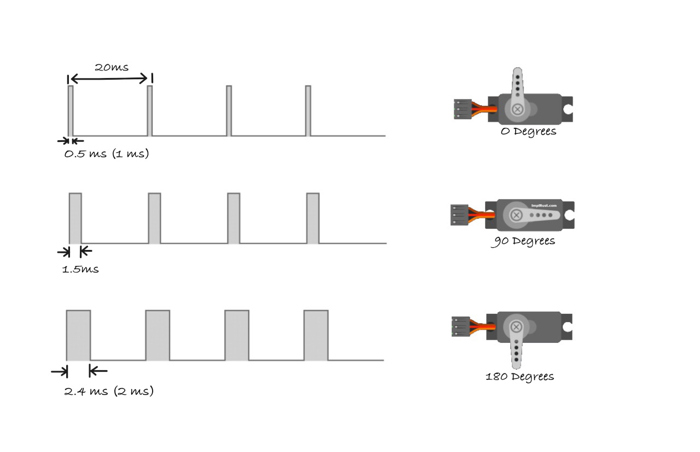

## More on PWM

The servo motor we're using operates at a 50Hz frequency, which means that a pulse is sent every 20 milliseconds (ms). 

Let's break this down further:
  - **50Hz Frequency:** Frequency refers to how many times an event happens in a given time period. A 50Hz frequency means that the servo expects a pulse to occur 50 times per second. In other words, the servo receives a pulse every 1/50th of a second, which is 20 milliseconds.
  - **20ms Time Interval:** This 20ms is the time between each pulse. It means that every 20 milliseconds, the servo expects a new pulse to adjust its position. Within this 20ms period, the width of the pulse (how long it stays "high") determines the angle at which the servo will move.

So, when we say the servo operates at 50Hz, it means that the motor is constantly receiving pulses every 20ms to keep it in motion or adjust its position based on the width of each pulse.

### Pulse Width and Duty Cycle
Let's dive deeper into how different pulse widths like 0.5ms, 1.5ms, and 2.4ms affect the servo's position.

#### 1. **0.5ms Pulse (Position: 0 degrees)**
- **What Happens**: A 0.5ms pulse means the signal is "high" for 0.5 milliseconds within each 20ms cycle. The servo interprets this as a command to move to the 0-degree position.
- **Duty Cycle**: The duty cycle refers to the percentage of time the signal is "high" in one complete cycle. For a 0.5ms pulse:
\\[
\text{Duty Cycle (\%)} = \\frac{0.5 \text{ms}}{20 \text{ms}} \\times 100 = 2.5\\%
\\]

  This means that for just 2.5% of each 20ms cycle, the signal stays "high" causing the servo to rotate to the 0-degree position.

#### 2. **1.5ms Pulse (Position: 90 degrees)**

- **What Happens**: A 1.5ms pulse means the signal is "high" for 1.5 milliseconds in the 20ms cycle. The servo moves to its neutral position, around 90 degrees (middle position).
- **Duty Cycle**: For a 1.5ms pulse:
\\[
\text{Duty Cycle (\%)} = \\frac{1.5 \text{ms}}{20 \text{ms}} \\times 100 = 7.5\\%
\\]
  Here, the signal stays "high" for 7.5% of the cycle, which positions the servo at 90 degrees (neutral).

#### 3. **2.4ms Pulse (Position: 180 degrees)**

- **What Happens**: A 2.4ms pulse means the signal is "high" for 2.4 milliseconds in the 20ms cycle. The servo will move to its maximum position, typically 180 degrees (full rotation to one side).
- **Duty Cycle**: For a 2.4ms pulse:
\\[
\text{Duty Cycle (\%)} = \\frac{2.4 \text{ms}}{20 \text{ms}} \\times 100 = 12\\%
\\]
  In this case, the signal is "high" for 12% of the cycle, which causes the servo to rotate to 180 degrees.

