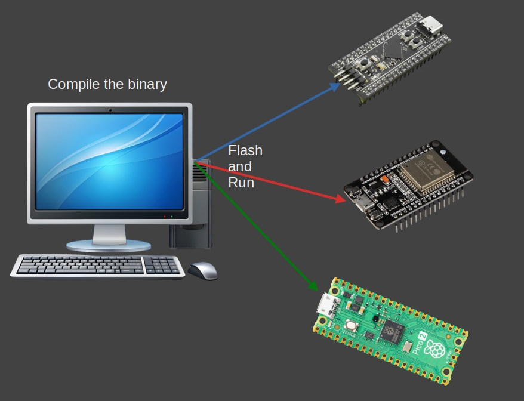

# 交叉编译

你可能已经了解交叉编译了。在本节中，我们将探讨它是如何工作的，以及处理像目标三元组（target triples）这样的东西意味着什么。简单来说，交叉编译就是为你正在使用的机器以外的机器构建程序。

你可以在一台计算机上编写代码，并制作在完全不同的计算机上运行的程序。例如，你可以在 Linux 上工作并为 Windows 构建 .exe 文件。你甚至可以针对像 RP2350、ESP32 或 STM32 这样的裸机微控制器（MCU）。

<div class="translator-note">
如果你不了解（看到这的应该不存在这个问题吧）就继续往下看：

**当我们开发目标是一个嵌入式设备时，便需要在PC机上编译出能在该嵌入式设备上运行的可执行文件，这里编译主机与目标运行主机不是同一个设备，那么该过程就称为交叉编译；**

如C/C++文件要经过预处理（preprocessing)、编译(compilation)、汇编（assembly)和链接(linking）等4步才能变成可执行文件
## 编译=?编译
这里的“交叉编译”里的“编译”，通常是广义的 build：从源代码到目标平台可执行物/固件的整条流水线
  - 狭义“编译”（compilation）：把预处理后的 C/C++ 变成汇编（.s）或中间表示。
  - 广义“编译/构建”（compile/build）：把源代码一路变成目标产物（.elf/.exe/.uf2），包含链
    接。
在日常交流中通常使用“编译”来统称，所以要结合语境。

## 核心概念
“交叉编译”不是某个单独步骤，而是：在 host 上运行的一套工具链（compiler/assembler/
  linker 等），产出给 target 运行的二进制。从编译原理角度看:
  - 前端（词法/语法/语义→IR）大体与平台无关；
  - 后端（指令选择、寄存器分配、调用约定、目标文件格式、链接与运行时）强烈依赖 target

交叉编译的“交叉”，主要发生在后端与链接/运行时这部分。
 

更多的Target Triple可以参考：
[Target Triple不仅仅是字符串](https://blog.aruoshui.fun/posts/53545.html)


</div>

> **简而言之（TL;DR）**
>
> 在为 Pico 2 构建二进制文件时，我们必须使用 "thumbv8m.main-none-eabihf" 或 "riscv32imac-unknown-none-elf" 作为target。
>
> `cargo build --target thumbv8m.main-none-eabihf`
>
> 我们也可以在 `.cargo/config.toml` 中配置target，这样就不需要每次都输入它了。



## 为你的主机系统构建

假设我们在 Linux 机器上。当你运行通常的构建命令时，Rust 会为你的当前主机平台编译代码，在这种情况下是 Linux：

```sh
cargo build
```

你可以使用 file 命令确认它刚刚生成了什么样的二进制文件：
```sh
file ./target/debug/pico-from-scratch
```

这将给出如下输出。这告诉你它是一个 64 位 ELF 二进制文件，动态链接，并且是为 Linux 构建的。

```sh
./target/debug/pico-from-scratch: ELF 64-bit LSB pie executable, x86-64, version 1 (SYSV), dynamically linked, interpreter /lib64/ld-linux-x86-64.so.2, Build...
```

## 为 Windows 交叉编译

现在假设你想在不离开 Linux 机器的情况下为 Windows 构建二进制文件。这就是交叉编译发挥作用的地方。

首先，你需要告诉 Rust 目标平台。你只需要做一次：
```sh
rustup target add x86_64-pc-windows-gnu
```

这添加了对使用 GNU 工具链（MinGW）生成 64 位 Windows 二进制文件的支持。

现在再次构建你的项目，这次指定目标：

```sh
cargo build --target x86_64-pc-windows-gnu
```
就是这样。Rust 现在将创建一个 Windows .exe 二进制文件，即使你仍然在 Linux 上。输出的二进制文件将位于 `target/x86_64-pc-windows-gnu/debug/pico-from-scratch.exe`

你可以像这样检查文件类型：
```sh
file target/x86_64-pc-windows-gnu/debug/pico-from-scratch.exe
```

它会给你这样的输出，一个用于 Windows 的 64 位 PE32+ 文件格式文件。
```shbutt
target/x86_64-pc-windows-gnu/debug/pico-from-scratch.exe: PE32+ executable (console) x86-64, for MS Windows
```

## 什么是目标三元组？

那么 `x86_64-pc-windows-gnu` 这个字符串到底是什么？

这就是我们所说的目标三元组（target triple），它准确地告诉编译器你想要什么样的输出。它通常遵循这种格式：

```html
`<architecture>-<vendor>-<os>-<abi>`
```

但这种模式并不总是一致的。有时 ABI 部分不会出现。在其他情况下，甚至供应商（vendor）或者供应商和 ABI 都可能缺失。结构可能会变得混乱，并且有很多例外。如果你想深入了解所有的怪癖和边缘情况，请查看参考资料中链接的文章 "What the Hell Is a Target Triple?"。

让我们分解一下这个目标三元组的实际含义：

- **架构（Architecture）(x86_64)**：这只是意味着 64 位 x86，这是大多数现代 PC 使用的 CPU 类型。它也被称为 AMD64 或 x64。

- **供应商（Vendor）(pc)**：这基本上是一个占位符。在大多数情况下它不是很重要。如果是针对 mac os，供应商名称将是 "apple"。

- **操作系统（OS）(windows)**：这告诉 Rust 我们想要构建在 Windows 上运行的东西。

- **二进制接口（ABI）(gnu)**：这部分告诉 Rust 使用 GNU 工具链来构建二进制文件。


## 参考资料

- [平台支持](https://doc.rust-lang.org/beta/rustc/platform-support.html)
- [交叉编译](https://rust-lang.github.io/rustup/cross-compilation.html)
- [目标三元组到底是什么鬼？](https://mcyoung.xyz/2025/04/14/target-triples/)
