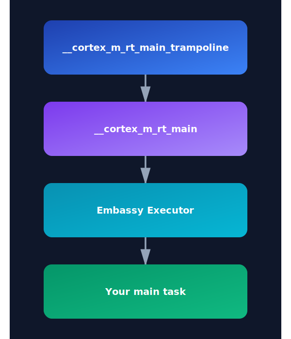

# no_main

当你尝试在这个阶段构建时，你会得到一个错误，说 main 函数需要标准库。那么现在怎么办？程序到底是从哪里开始的？

在嵌入式系统中，我们不使用依赖于标准库的常规 "fn main"。相反，只要告诉 Rust 我们会提供我们自己的入口点。为此，我们使用 `no_main` 属性。

`#![no_main]` 属性用于指示程序将不使用标准入口点（`fn main`）。

在你的 `src/main.rs` 文件顶部，添加这行代码：

```rs
#![no_main]
```

## 声明入口点

既然我们已经选择不使用默认入口点，我们需要告诉 Rust 从哪个函数开始。嵌入式 Rust 生态系统中的每个硬件抽象层（HAL）crate 都提供了一个特殊的属性宏（proc macro），允许我们标记入口点。这个宏会初始化并设置微控制器所需的一切。

如果我们使用 `rp-hal`，我们可以对 RP2350 芯片使用 `rp235x_hal::entry`。但是，我们将使用 Embassy（`embassy-rp` crate）。Embassy 提供了 `embassy_executor::main` 宏，它为任务设置异步运行时并调用我们的 main 函数。

> Embassy Executor 是更为嵌入式使用设计的 async/await 执行器，并支持中断和计时器功能。你可以阅读官方的 [Embassy 书籍](https://embassy.dev/book) 来深入了解 Embassy 的工作原理。


### Cortex-m Run Time

如果你追踪 [`embassy_executor::main`](https://github.com/embassy-rs/embassy/blob/2c1c5232e8767887cbad5f28abf9a39ae78dd6c4/embassy-executor-macros/src/lib.rs#L69) 宏，你会看到它根据架构使用另一个宏。由于 Pico 2 是 Cortex-M 架构，它使用 `cortex_m_rt::entry`。这来自 `cortex_m_rt` crate，它为 Cortex-M 微控制器提供启动代码和最小运行时。

<a href="./images/embassy-entry-point.svg"></a>

如果你在 `quick-start` 项目中运行 `cargo expand`，你可以看到宏是如何展开的以及完整的执行流程。如果你深入研究，程序是从 `__cortex_m_rt_main_trampoline` 函数开始的。这个函数调用 `__cortex_m_rt_main`，后者设置 Embassy 执行器并运行我们的 main 函数。

<div class=translator-note>

注意使用 `cargo expand` 请先执行`cargo install cargo-expand` 

这个[cargo-expand](https://crates.io/crates/cargo-expand)是用来展开 Rust 中的宏定义(`macro expansion`)和 `#[derive`] 注解的扩展效果。


</div>

为了使用这个功能，我们需要将 `cortex-m` 和 `cortex-m-rt` crate 添加到我们的项目中。更新 `Cargo.toml` 文件：

```toml
cortex-m = { version = "0.7.6" }
cortex-m-rt = "0.7.5"
```

现在，我们可以添加 `embassy-executor` crate：

```toml
embassy-executor = { version = "0.9", features = [
  "arch-cortex-m",
  "executor-thread",
] }
```

然后，在你的 `main.rs` 中，像这样设置入口点：

```rust
use embassy_executor::Spawner;

#[embassy_executor::main]
async fn main(_spawner: Spawner) {}
```

我们已经更改了函数签名。该函数必须接受一个 `Spawner` 作为参数以满足 Embassy 的要求，并且该函数现在被标记为 `async`。


## 我们到了吗？

万岁！现在尝试构建项目 - 它应该能成功编译。

你可以使用 `file` 命令检查生成的二进制文件：

```sh
file target/thumbv8m.main-none-eabihf/debug/pico-from-scratch
```

它会显示类似这样的内容：

```sh
target/thumbv8m.main-none-eabihf/debug/pico-from-scratch: ELF 32-bit LSB executable, ARM, EABI5 version 1 (GNU/Linux), statically linked, with debug_info, not stripped
```
如你所见，该二进制文件是为 32-bit ARM 构建的。这意味着我们 Pico 的基础设置正在工作。

但是我们到了吗？还没完全到。我们已经完成了这一阶段的一半工作 - 我们现在有了一个准备好在 Pico 上运行的有效二进制文件，但在我们可以在真实硬件上运行它之前，还有更多工作要做。


**参考资源：**
- [Rust 官方文档](https://doc.rust-lang.org/reference/crates-and-source-files.html?highlight=no_main#the-no_main-attribute)
- [使用 Rust 编写操作系统](https://os.phil-opp.com/freestanding-rust-binary/#overwriting-the-entry-point)

