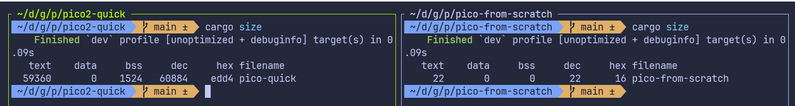

# 链接脚本

程序现在可以成功编译。然而，当你尝试将其烧录到 Pico 上时，你可能会遇到如下错误：

```sh
ERROR: File to load contained an invalid memory range 0x00010000-0x000100aa
```

## 将我们的项目与快速开始项目进行对比

为了理解为什么烧录会失败，让我们使用 `arm-none-eabi-readelf` 工具检查编译后的程序。这个工具展示了编译器和链接器是如何在内存中组织程序的。

我取出了 `quick-start` 项目的二进制文件，并将其与我们项目当前生成的二进制文件进行了比较。

<div class="image-with-caption" style="text-align:center; display:inline-block;">
    
    <div class="caption" style="font-size:0.9em; color:#555; margin-top:6px;">Quick Start 对比我们的项目</div>
</div>

你不需要理解输出中的每一个细节。重要的是要注意到这两个二进制文件看起来非常不同，尽管我们的 Rust 代码几乎是一样的。

最大的区别在于我们的项目缺失了一些重要的段（section），如 `.text`、`.rodata`、`.data` 和 `.bss`。这些段通常由链接器创建：

- .text : 实际的程序指令（代码）存放于此
- .rodata : 只读数据，例如常量值
- .data : 已初始化的全局或静态变量
- .bss : 未初始化的全局或静态变量

你还可以通过 [cargo-binutils](https://github.com/rust-embedded/cargo-binutils) 工具集提供的 `cargo size` 命令来比较它们。


<div class="image-with-caption" style="text-align:center; display:inline-block;">
    
    <div class="caption" style="font-size:0.9em; color:#555; margin-top:6px;">cargo size：Quick Start 对比我们的项目</div>
</div>

**链接器（Linker）：**

这通常由所谓的链接器来处理。链接器的作用是将我们程序的所有部分（如编译后的代码、库代码、启动代码和数据）组合成一个设备实际上可以运行的最终可执行文件。它还决定了程序的每个部分应该放置在内存中的什么位置，例如代码放在哪里，全局变量放在哪里。

然而，链接器不会自动知道 RP2350 的内存布局。我们必须告诉它 Flash 和 RAM 是如何排列的。这是通过链接脚本完成的。如果链接脚本缺失或不正确，链接器就不会将我们的代码放置在正确的内存区域中，从而导致我们看到的烧录错误。

### 链接脚本

我们不打算自己编写链接脚本。`cortex-m-rt` crate 已经提供了主链接脚本（`link.x`），但它只了解 Cortex-M 核心。它对我们使用的具体微控制器一无所知。每个微控制器都有自己的 Flash 大小、RAM 大小和内存布局，`cortex-m-rt` 无法猜测这些值。

因此，`cortex-m-rt` 期望用户或板级支持 crate 提供一个名为 `memory.x` 的小型链接脚本。该文件描述了目标设备的内存布局。

在 `memory.x` 中，我们必须定义设备拥有的内存区域。至少，我们需要两个区域：一个名为 FLASH，另一个名为 RAM。程序的 `.text` 和 `.rodata` 段会被放置在 FLASH 区域。`.bss` 和 `.data` 段以及堆（heap）会被放置在 RAM 区域。

对于 RP2350，数据手册（第 2.2 章，Address map）通过指出 Flash 起始地址为 `0x10000000`，SRAM 起始地址为 `0x20000000`。所以我们的 `memory.x` 文件看起来会像这样：

```
MEMORY {
    FLASH : ORIGIN = 0x10000000, LENGTH = 2048K
    
    RAM : ORIGIN = 0x20000000, LENGTH = 512K
    SRAM4 : ORIGIN = 0x20080000, LENGTH = 4K
    SRAM5 : ORIGIN = 0x20081000, LENGTH = 4K
    ...
    ...
}
...
...
```

RP2350 在 `memory.x` 中还需要一些额外的设置。我们不需要手动编写这些内容。相反，我们将使用 `embassy-rp` 示例仓库中提供的文件。你可以从[这里](https://github.com/embassy-rs/embassy/blob/a6d392b24c5f010a8b5b2a00326c04b05a4ab0f0/examples/rp235x/memory.x)下载它，并将其放置在你的项目根目录下。


## 链接器的代码生成选项

仅仅将 `memory.x` 文件放在项目文件夹中是不够的。我们还需要确保链接器实际上使用了 `cortex-m-rt` 提供的链接脚本。


为了解决这个问题，我们要告诉 Cargo 将链接脚本（`link.x`）传递给链接器。我们可以通过多种方式将参数传递给 Rust。我们可以使用 `.cargo/config.toml` 或构建脚本（`build.rs`）文件等方法。在快速开始中，我们使用的是 `build.rs`。所以这里我们将使用 `.cargo/config.toml` 方式。在该文件中，使用以下内容更新目标（target）部分：

```toml
[target.thumbv8m.main-none-eabihf]
runner = "picotool load -u -v -x -t elf" # 我们已经添加了这个
rustflags = ["-C", "link-arg=-Tlink.x"]  # 这是新增的一行 
```

## 运行 Pico

一切设置就绪后，你现在可以将程序烧录到 Pico 上了：

```rust
cargo run --release
```

呼……我们将一个普通的 Rust 项目变成了一个用于 Pico 的 `no_std` 固件。终于，我们可以看到 LED 闪烁了。


## 参考资源

-  [关于链接脚本你从未想知道的一切](https://mcyoung.xyz/2021/06/01/linker-script/)

