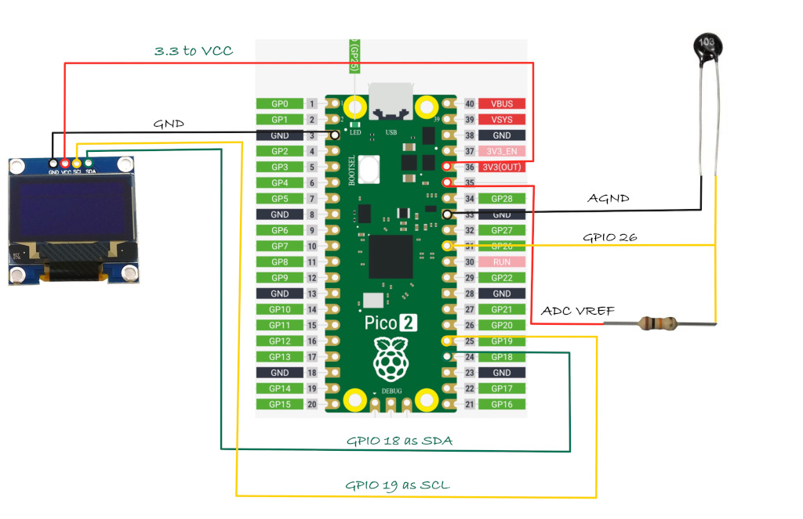

# Temperature on OLED

In this section, we will measure the temperature in your room and display it on the OLED screen.

## Hardware Requirments

- An OLED display: (0.96 Inch I2C/IIC 4-Pin, 128x64 resolution, SSD1306 chip)
- Jumper wires
- NTC 103 Thermistor: 10K OHM, 5mm epoxy coated disc
- 10kΩ Resistor: Used with the thermistor to form a voltage divider 

## Circuit to connect OLED, Thermistor with Raspberry Pi Pico

1. **One side of the Thermistor** is connected to **AGND** (Analog Ground).
2. The **other side of the Thermistor** is connected to **GPIO26 (ADC0)**, which is the analog input pin of the pico2
3. A **resistor** is connected in series with the Thermistor to create a voltage divider between the Thermistor and **ADC_VREF** (the reference voltage for the ADC).

Note:Here, one side of the thermistor is connected to ground, as shown. If you've connected it to the power supply instead, you'll need to use the alternate formula mentioned earlier.

## The Flow

- We read the ADC value 
- Get resisance value from ADC value
- Calculate temperature using B parameter equation
- Display the ADC, Resistance, Temperature(in Celsius) in the OLED
