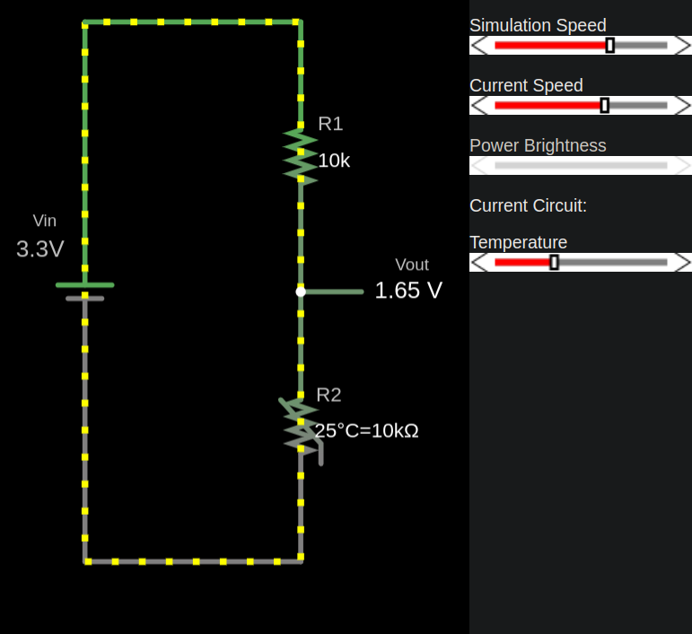
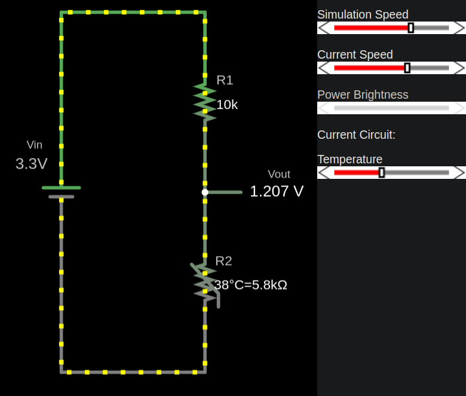

## NTC and Voltage Divider

I have created a circuit on the Falstad website, and you can download the [voltage-divider-thermistor.circuitjs.txt](./voltage-divider-thermistor.circuitjs.txt) ile to import and experiment with.   This setup is similar to what we covered in the [voltage divider chapter of the LDR section](../core-concepts/voltage-divider.md). If you haven't gone through that section, I highly recommend completing the theory there before continuing.

This circuit includes a 10kΩ thermistor with a resistance of 10kΩ at 25°C. The input voltage \\( V_{in} \\) is set to 3.3V.

### Themistor at 25°C
The thermistor has a resistance of 10kΩ at 25°C, resulting in an output voltage (\\( V_{out} \\)) of 1.65V.

## Thermistor at 38°C
The thermistor's resistance decreases due to its negative temperature coefficient, altering the voltage divider's output.

## Thermistor at 10°C
The thermistor's resistance increases, resulting in a higher output voltage (\\( V_{out} \\)).

