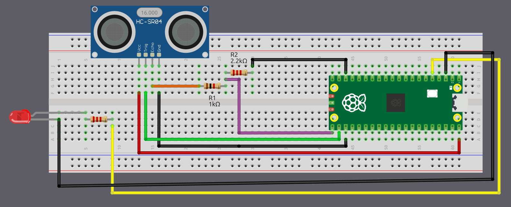

# Wiring the HC-SR04 to the Pico 2 Using a Voltage Divider

If you are using the regular HC-SR04 like I am, you will need to create a voltage divider for the Echo pin. In this section we will look at how to set up the circuit. However, if you are lucky and you bought the HC-SR04 Plus, you can skip to the next page. The circuit becomes much simpler because you can power the sensor with 3.3 V instead of 5 V.

## Common resistor combination

Below are some resistor pairs you can use to bring the HC-SR04 Echo signal down to about 3.3 V. R1 is the resistor connected to the Echo pin, and R2 is the resistor connected to ground.

| R1 (With Echo) | R2 (With Gnd) | Output Voltage |
|----------------|----------------|----------------|
| 330 Ω          | 470 Ω          | 2.94 V         |
| 330 Ω          | 680 Ω          | 3.37 V         |
| 470 Ω          | 680 Ω          | 2.96 V         |
| 680 Ω          | 1 kΩ           | 2.98 V         |
| 1 kΩ           | 1.8 kΩ         | 3.21 V         |
| 1 kΩ           | 2 kΩ           | 3.33 V         |
| 1 kΩ           | 2.2 kΩ         | 3.44 V         |
| 1.5 kΩ         | 2.2 kΩ         | 2.97 V         |
| 2.2 kΩ         | 3.3 kΩ         | 3.00 V         |
| 3.3 kΩ         | 4.7 kΩ         | 2.94 V         |
| 4.7 kΩ         | 6.8 kΩ         | 2.96 V         |
| 6.8 kΩ         | 10 kΩ          | 2.98 V         |
| 22 kΩ          | 33 kΩ          | 3.00 V         |
| 33 kΩ          | 47 kΩ          | 2.94 V         |
| 47 kΩ          | 68 kΩ          | 2.96 V         |

You can choose any resistor pair from the table because all of them bring the 5 V Echo signal down to a safe level near 3.3 V. In practice it is best to use the values you already have in your kit. 

## Connection for the Raspberry Pi Pico 2 and Ultrasonic Sensor

<table>
  <thead>
    <tr>
      <th>Pico 2 Pin</th>
      <th style="height: 4px; width: 250px; margin: 0 auto;">Wire</th>
      <th>HC-SR04 Pin</th>
    </tr>
  </thead>
  <tbody>
    <tr>
      <td>VBUS (Pin 40)</td>
      <td style="text-align: center; vertical-align: middle; padding: 0;">
        

          

          

        

      </td>
      <td>VCC</td>
    </tr>
    <tr>
      <td>GPIO 17</td>
      <td style="text-align: center; vertical-align: middle; padding: 0;">
        

          

          

        

      </td>
      <td>Trig</td>
    </tr>
    <tr>
      <td>GPIO 16 (via Voltage Divider)</td>
      <td style="text-align: center; vertical-align: middle; padding: 0;">
        

          

          

        

      </td>
      <td>Echo (through 1kΩ/2.2kΩ divider)</td>
    </tr>
    <tr>
      <td>GND</td>
      <td style="text-align: center; vertical-align: middle; padding: 0;">
        

          

          

        

      </td>
      <td>GND</td>
    </tr>
  </tbody>
</table>

- **VCC**: Connect the VCC pin on the HC-SR04 to VBUS (Pin 40) on the Pico 2. The HC-SR04 requires 5V power, and VBUS provides 5V from the USB connection.
- **Trig**: Connect to GPIO 17 on the Pico 2 to trigger the ultrasonic sound pulses.
- **Echo**: Connect to GPIO 16 on the Pico 2 through a voltage divider (1kΩ resistor from Echo pin, 2kΩ or 2.2kΩ resistor to ground). The junction between the resistors connects to GPIO 16. This divider steps down the 5V Echo signal to ~3.4V, protecting the Pico's 3.3V GPIO pins.
- **GND**: Connect to any ground pin on the Pico 2.

## Connection for the Pico 2 and LED

<table>
  <thead>
    <tr>
      <th>Pico 2 Pin</th>
      <th style="width: 250px; margin: 0 auto;">Wire</th>
      <th>Component</th>
    </tr>
  </thead>
  <tbody>
    <tr>
      <td>GPIO 3</td>
      <td style="text-align: center; vertical-align: middle; padding: 0;">
        

          

          

        

      </td>
      <td>Resistor (220Ω-330Ω)</td>
    </tr>
    <tr>
      <td>Resistor</td>
      <td style="text-align: center; vertical-align: middle; padding: 0;">
        

          

          

        

      </td>
      <td>Anode (long leg) of LED</td>
    </tr>
    <tr>
      <td>GND</td>
      <td style="text-align: center; vertical-align: middle; padding: 0;">
        

          

          

        

      </td>
      <td>Cathode (short leg) of LED</td>
    </tr>
  </tbody>
</table>
