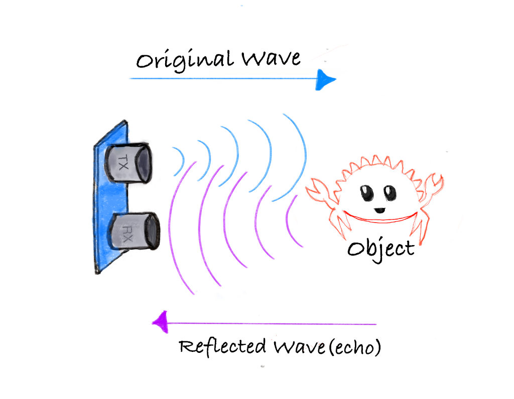

# How Does an Ultrasonic Sensor Work?

Ultrasonic sensors work by emitting sound waves at a frequency too high (40kHz) for humans to hear. These sound waves travel through the air and bounce back when they hit an object. The sensor calculates the distance by measuring how long it takes for the sound waves to return.



- **Transmitter:** Sends out ultrasonic sound waves.
- **Receiver:** Detects the sound waves that bounce back from an object.

**Formula to calculate distance**: 
```
Distance = (Time x Speed of Sound) / 2
```

The speed of sound is approximately 0.0343 cm/µs (or 343 m/s) at normal air pressure and a temperature of 20°C.

## Example Calculation:

Let's say the ultrasonic sensor detects that the sound wave took 2000 µs to return after hitting an object.

Step 1: Calculate the total distance traveled by the sound wave:
```
Total distance = Time x Speed of Sound
Total distance = 2000 µs x 0.0343 cm/µs = 68.6 cm
```

Step 2: Since the sound wave traveled to the object and back, the distance to the object is half of the total distance:
```
Distance to object = 68.6 cm / 2 = 34.3 cm
```

Thus, the object is 34.3 cm away from the sensor.


## HC-SR04 Pinout

The module has four pins: VCC, Trig, Echo, and GND.

<table style="width:300px;height:200px;">
<tr>
    <th>Pin</th>
    <th>Function</th>
</tr>
<tr>
    <td style="vertical-align: middle;text-align: center;" class="slanted-text st-red">VCC</td>
    <td>Power Supply</td>
</tr>
<tr>
    <td style="vertical-align: middle;text-align: center;" class="slanted-text st-yellow">Trig</td>
    <td>Trigger Signal</td>
</tr>
<tr>
    <td style="vertical-align: middle;text-align: center;" class="slanted-text st-teal">Echo</td>
    <td>Echo Signal</td>
</tr>
<tr>
    <td style="vertical-align: middle;text-align: center;" class="slanted-text st-blue">GND</td>
    <td>Ground</td>
</tr>
</table>


## Measuring Distance with the HC-SR04 module

The HC-SR04 module has a transmitter and receiver, responsible for sending ultrasonic waves and detecting the reflected waves.  We will use the Trig pin to send sound waves. And read from the Echo pin to measure the distance.


As you can see in the diagram, we connect the Trig and Echo pins to the GPIO pins of the microcontroller (we also connect VCC and GND but left them out to keep the illustration simple). We send ultrasonic waves by setting the Trig pin HIGH for 10 microseconds and then setting it back to LOW. This triggers the module to send 8 consecutive ultrasonic waves at a frequency of 40 kHz.  It is recommended to have a minimum gap of 50ms between each trigger.

When the sensor's waves hit an object, they bounce back to the module. As you can see in the diagram, the Echo pin changes the signal sent to the microcontroller, with the length of time the signal stays HIGH (pulse width) corresponding to the distance. In the microcontroller, we measure how long the Echo pin stays HIGH; Then, we can use this time duration to calculate the distance to the object.

**Pulse width and the distance:**

The pulse width (amount of time it stays high) produced by the Echo pin will range from about 150µs to 25,000µs(25ms); this is only if it hits an object. If there is no object, it will produce a pulse width of around 38ms.


