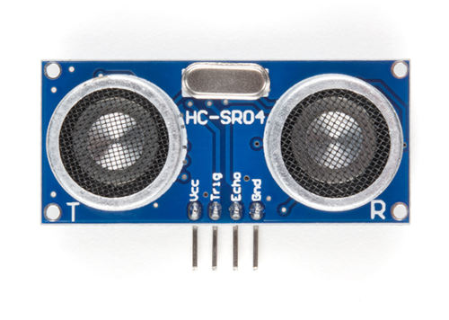

# Bat Beacon: Distance Sensor Project 🦇 

If you've seen the Batman Begins movie, you'll remember the scene where Batman uses a device that emits ultrasonic signals to summon a swarm of bats. It's one of the coolest gadgets in his arsenal! While we won't be building a bat-summoning beacon today, we will be working with the similar ultrasonic technology.

## Ultrasonic

Ultrasonic waves are sound waves with frequencies above 20,000 Hz, beyond what human ears can detect. But many animals can. Bats use ultrasonic waves to fly in the dark and avoid obstacles. Dolphins use them to communicate and to sense objects underwater.

### Ultrasonic Technology Around You

Humans have borrowed this natural sonar principle for everyday inventions:

- **Car parking sensors** use ultrasonic sensors to detect obstacles when you reverse. As you get closer to an object, the beeping gets faster.
- **Submarines** use sonar to navigate and detect underwater objects
- **Medical ultrasound** allows doctors to see inside the human body
- **Automatic doors and robot navigation** rely on ultrasonic distance sensing

Today, you'll build your own distance sensor using an ultrasonic module; sending out sound waves, measuring how long they take to bounce back, and calculating distance.

## Meet the Hardware

The HC-SR04+ is a simple and low cost ultrasonic distance sensor. It can measure distances from about 2 cm up to 400 cm. It works by sending out a short burst of ultrasonic sound and then listening for the echo. By measuring how long the echo takes to return, the sensor can calculate how far the object is.

> <i class="fa-solid fa-bolt"></i> **Important Note about Variants:**
> 
> The HC-SR04 normally operates at 5V, which can be problematic for the Raspberry Pi Pico. If possible, purchase the **HC-SR04+** version, which works with both 3.3V and 5V, making it more suitable for the Pico.
> 
> **Why This Matters:**
> The HC-SR04's Echo pin outputs a 5V signal, but the Pico's GPIO pins can only safely handle 3.3V. Connecting 5V directly to the Pico could damage it.
> 
> **Your Options:**
> 
> 1. **Buy the HC-SR04+ variant** (recommended and easiest solution)
> 2. **Use a voltage divider** on the Echo pin to reduce the 5V signal to 3.3V
> 3. **Use a logic level converter** to safely step down the voltage
> 4. **Power the HC-SR04 with 3.3V** (not recommended, as it may work unreliably or not at all)

In this project, we'll build a proximity detector that gradually brightens an LED as objects get closer. When the sensor detects something within 30 cm, the LED will glow brighter using PWM. You can change the distance value if you want to try different ideas.

## Prerequisites

Before starting, get familiar with yourself on these topics

- [PWM](../core-concepts/pwm/index.md)
- [Voltage Divider](../core-concepts/voltage-divider.md)

## Hardware Requirements

To complete this project, you will need:

- HC-SR04+ or HC-SR04 Ultrasonic Sensor
- Breadboard
- Jumper wires
- External LED (You can also use the onboard LED, but you'll need to modify the code accordingly)
- If you are using the standard HC-SR04 module that operates at 5V, you will need two resistors (1kΩ and 2kΩ or 2.2kΩ) to form a voltage divider.

The HC-SR04 Sensor module has a transmitter and receiver. The module has Trigger and Echo pins which can be connected to the GPIO pins of a pico. When the receiver detects the returning sound wave, the Echo pin goes HIGH for a duration equal to the time it takes for the wave to return to the sensor.

## Datasheet

Most electronic components come with a datasheet. It's a technical document that tells you everything you need to know about how the component works, its electrical characteristics, and how to use it properly. 

For the HC-SR04 ultrasonic sensor, you can find the datasheet here:
[https://cdn.sparkfun.com/datasheets/Sensors/Proximity/HCSR04.pdf](https://cdn.sparkfun.com/datasheets/Sensors/Proximity/HCSR04.pdf)

Datasheets can look intimidating at first with all their technical specifications and diagrams, but you don't need to understand everything in them.
